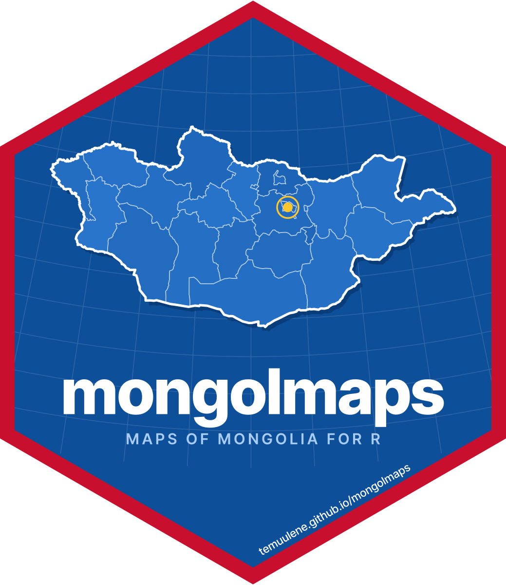

<!-- README.md is generated from README.Rmd. Please edit that file -->

```{r, include = FALSE}
knitr::opts_chunk$set(
  collapse = TRUE,
  comment = "#>",
  fig.path = "man/figures/README-",
  dpi = 200,
  dev = "ragg_png",
  out.width = "100%"
)
```

# mongolmaps <a href="https://temuulene.github.io/mongolmaps/"></a>

<!-- badges: start -->
[](https://lifecycle.r-lib.org/articles/stages.html#experimental)
<!-- badges: end -->

**Maps of Mongolia and Ulaanbaatar for R, at every openly available
administrative level.** One package, no downloads to start, and names that
match however you spell them.

Монгол хэлээр: <https://temuulene.github.io/mongolmaps/mn/>

| Level | Function | Units |
|---|---|---|
| Country | `mn_country()` | 1 |
| Economic regions | `mn_regions()` | 5 |
| Aimags (provinces) and the capital | `mn_aimags()` | 22 |
| Soums and Ulaanbaatar districts | `mn_soums()`, `mn_ub_districts()` | 330 + 9 |
| Ulaanbaatar khoroos | `mn_khoroos()` | 204 |
| Bags | `mn_bags()` | codes and names of all ~1,650; boundaries from NSO on request |

Every function returns an `sf` table with the same columns (codes, English
and Mongolian names, parent units, area), so maps at different levels work
the same way.

## Installation

```r
# install.packages("pak")
pak::pak("temuulene/mongolmaps")
```

## Your first map

```{r first-map, fig.height = 4.2}
library(mongolmaps)

mn_map(label = TRUE)
```

`mn_map()` picks a projection suited to Mongolia, labels places inside their
borders and credits the data source.

## Your data on a map

`mn_join()` attaches a data frame to the boundaries. The place column can use
any spelling, Cyrillic, or the codes used in National Statistics Office
(NSO) tables. Totals and other levels in NSO tables are dropped for you.

```{r join, fig.height = 4.2}
pop <- mn_example_population[mn_example_population$Year == 2025, ]

pop_map <- mn_join(pop, by = "Region", level = "aimag")

mn_map(pop_map, fill = value, trans = "log10", context = TRUE,
       title = "Population by aimag, 2025")
```

## Ulaanbaatar down to khoroos

```{r ub, fig.height = 5}
# The six central districts, by their usual abbreviations
central <- c("BGD", "BZD", "ChD", "KhUD", "SKhD", "SBD")
khoroo_pop <- mn_join(pop, by = "Region", level = "bag", within = central)

mn_map(khoroo_pop, fill = value / area_km2, trans = "log10",
       title = "People per km2 by khoroo, central Ulaanbaatar, 2025")
```

Khoroos are labelled with their number; districts and other units with their
name, in English or Mongolian:

```{r ub-labels, fig.height = 4.5}
mn_map(mn_ub_districts(), label = TRUE, lang = "mn")
```

## Names in any spelling

```{r match}
mn_match(c("Khuvsgul", "Hovsgol", "Khövsgöl", "Хөвсгөл", "MN-041", "267"))

mn_match("Sukhbaatar district")
mn_match("Bayan-Uul", level = "soum", within = "Dornod")

mn_codes("soum", within = "Khovd")
```

## More

* Interactive maps: `mn_leaflet(mn_khoroos(), fill = area_km2)`.
* Labels in Mongolian: `lang = "mn"` in any function, or
  `options(mongolmaps.lang = "mn")`.
* Full-resolution boundaries: `resolution = "high"` (downloaded once and
  cached).
* Settlements, rivers, lakes and neighbouring countries: `mn_settlements()`,
  `mn_rivers()`, `mn_lakes()`, `mn_neighbours()`.
* Roads, railways, airports and places from OpenStreetMap:
  `mn_roads(within = "Ulaanbaatar")`, `mn_railways()`, `mn_airports()`,
  `mn_places()` (downloaded once and cached).
* Elevation, hillshade, land cover and population grids (with terra):
  `mn_map(mn_elevation())`, `mn_landcover()`, `mn_population(2025)`, and
  `mn_zonal()` to sum them by aimag, soum or khoroo.
* Protected areas: `mn_protected_areas()`.
* Small multiples: `mn_aimag_grid` for `geofacet::facet_geo()`.

## Data sources

```{r sources, echo = FALSE}
knitr::kable(mn_sources()[c("title", "provider", "license")])
```

Khoroo boundaries come from an open project that does not state their
origin, so treat them as **unofficial**. Bag boundaries are not openly
published; see `?mn_bags` for how to use them once you get them from NSO.
Please credit the providers when you publish maps: `mn_citation()` returns
the text, and `mn_map()` adds it as a caption.
