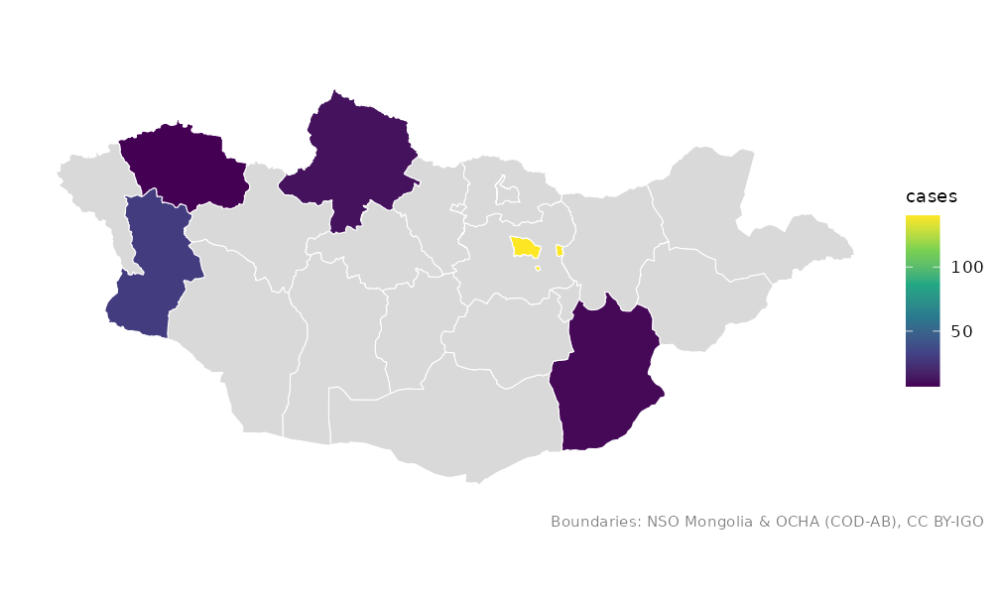
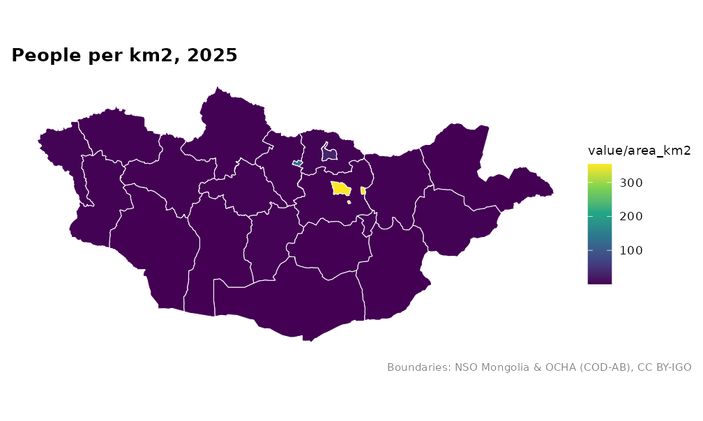
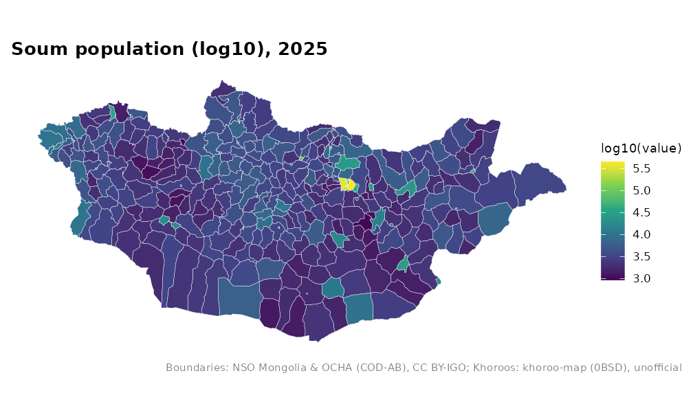
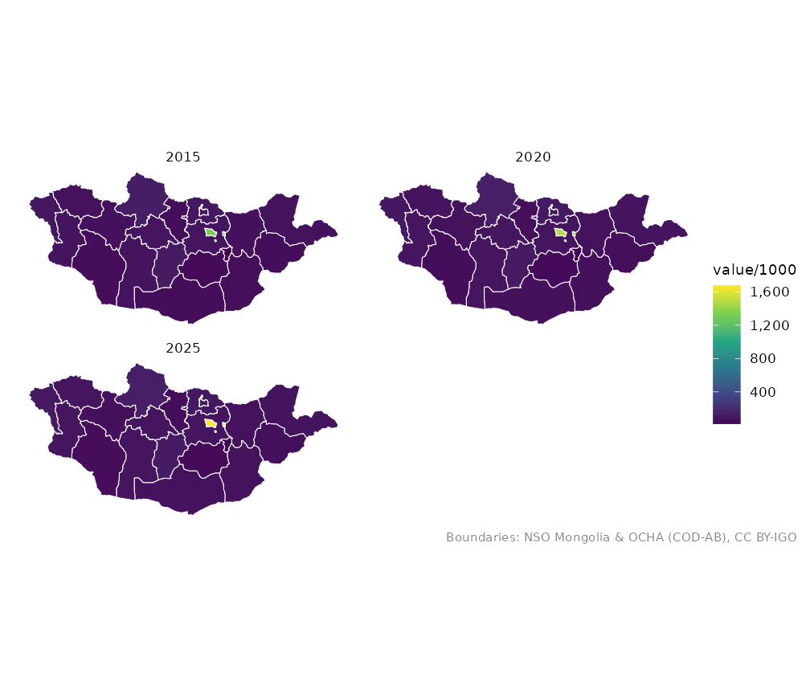

# Putting your data on a map

``` r

library(mongolmaps)
```

The usual workflow has three steps: get a table with one row per place,
join it to boundaries with
[`mn_join()`](https://temuulene.github.io/mongolmaps/reference/mn_join.md),
and draw it with
[`mn_map()`](https://temuulene.github.io/mongolmaps/reference/mn_map.md).

## A small table

Place names can be written any common way, in English or Cyrillic:

``` r

cases <- data.frame(
  aimag = c("Khovsgol", "Hovd", "\u0423\u0432\u0441", "Ulan Bator", "Dornogobi"),
  cases = c(12, 30, 7, 140, 9)
)
cases_map <- mn_join(cases, by = aimag)
cases_map[c("name", "cases")]
#> Simple feature collection with 22 features and 2 fields
#> Geometry type: MULTIPOLYGON
#> Dimension:     XY
#> Bounding box:  xmin: 87.7345 ymin: 41.58183 xmax: 119.9315 ymax: 52.14835
#> Geodetic CRS:  WGS 84
#> # A tibble: 22 × 3
#>    name        cases                                                    geometry
#>    <chr>       <dbl>                                          <MULTIPOLYGON [°]>
#>  1 Ulaanbaatar   140 (((107.402 47.44143, 107.4284 47.43277, 107.4883 47.4369, …
#>  2 Dornod         NA (((112.8455 49.52838, 112.8556 49.53561, 112.8548 49.54133…
#>  3 Sukhbaatar     NA (((112.4235 45.07442, 112.4136 45.07144, 112.3912 45.06256…
#>  4 Khentii        NA (((109.0694 49.32394, 109.1747 49.35551, 109.2381 49.34512…
#>  5 Tuv            NA (((106.5653 48.55343, 106.6387 48.54782, 106.6544 48.54902…
#>  6 Govisumber     NA (((108.9589 46.96853, 108.9515 46.83761, 109.0603 46.86484…
#>  7 Selenge        NA (((106.1047 50.33643, 106.1178 50.33467, 106.1268 50.33695…
#>  8 Dornogovi       9 (((108.6727 45.09002, 108.5957 45.22638, 108.5877 45.28667…
#>  9 Darkhan-Uul    NA (((105.8979 49.38937, 105.9035 49.39209, 105.9015 49.39707…
#> 10 Umnugovi       NA (((102.9931 42.03581, 102.8919 42.07717, 102.768 42.12758,…
#> # ℹ 12 more rows
```

Every aimag stays in the result, so places without data show up grey:

``` r

mn_map(cases_map, fill = cases)
```



## NSO tables

Tables from the National Statistics Office list several levels in one
column (the national total, regions, aimags, soums …). Join them by the
code column, not the label column: labels such as “Ulaanbaatar” name
both a region and an aimag.
[`mn_join()`](https://temuulene.github.io/mongolmaps/reference/mn_join.md)
keeps the level you ask for and drops the rest with a message.

``` r

head(mn_example_population)
#> # A tibble: 6 × 4
#>   Region  Region_en           Year   value
#>   <chr>   <chr>              <int>   <dbl>
#> 1 0       Total               2015 2964085
#> 2 1       Western region      2015  381840
#> 3 181     Zavkhan             2015   69637
#> 4 18101   Uliastai            2015   15871
#> 5 1810151 1-r bag, Jinst      2015    3333
#> 6 1810153 2-r bag, Jargalant  2015    2978

pop_2025 <- mn_example_population[mn_example_population$Year == 2025, ]
aimag_pop <- mn_join(pop_2025, by = "Region", level = "aimag")
#> ℹ Joining at the aimag level; dropped 6 rows for larger units ("country" and
#>   "region") and 2196 rows for smaller units ("soum" and "bag").
mn_map(aimag_pop, fill = value / area_km2, title = "People per km2, 2025")
```



The same table has soum figures:

``` r

soum_pop <- mn_join(pop_2025, by = "Region", level = "soum")
#> ℹ Joining at the soum level; dropped 28 rows for larger units ("country",
#>   "region", and "aimag") and 1853 rows for smaller units ("bag").
#> ℹ 4 matched places have no boundary and are left out:
#> • Tsagaannuur (MN8340, Bayan-Ulgii)
#> • Khatgal (MN6770, Khuvsgul)
#> • Berh (MN2355, Khentii)
#> • Gurvanbayan (MN2358, Khentii)
#> ℹ Villages and rural bags have NSO codes but no public boundary; see
#>   `?mongolmaps::mn_bags()`.
mn_map(soum_pop, fill = log10(value), title = "Soum population (log10), 2025")
```



## Several rows per place

Rows for several years give several copies of each polygon, ready for
facets:

``` r

pop_years <- mn_join(mn_example_population, by = "Region", level = "aimag")
#> ℹ Joining at the aimag level; dropped 18 rows for larger units ("country" and
#>   "region") and 6588 rows for smaller units ("soum" and "bag").
mn_map(pop_years, fill = value / 1000) + ggplot2::facet_wrap(~Year, ncol = 2)
```



## Repeated soum names

Many soums share a name. Give each row’s aimag with `by_parent`:

``` r

soums <- data.frame(
  aimag = c("Dornod", "Govi-Altai", "Khentii"),
  soum = c("Bayan-Uul", "Bayan-Uul", "Bayan-Adarga"),
  herders = c(820, 640, 910)
)
joined <- mn_join(soums, by = "soum", level = "soum", by_parent = "aimag")
joined[!is.na(joined$herders), c("name", "aimag_pcode", "herders")]
#> Simple feature collection with 3 features and 3 fields
#> Geometry type: MULTIPOLYGON
#> Dimension:     XY
#> Bounding box:  xmin: 94.1555 ymin: 46.7045 xmax: 113.3802 ymax: 49.52838
#> Geodetic CRS:  WGS 84
#> # A tibble: 3 × 4
#>   name         aimag_pcode herders                                      geometry
#>   <chr>        <chr>         <dbl>                            <MULTIPOLYGON [°]>
#> 1 Bayan-Uul    MN21            820 (((113.2758 48.84648, 113.1614 48.77836, 113…
#> 2 Bayan-Adarga MN23            910 (((111.5415 48.76606, 111.5635 48.74407, 111…
#> 3 Bayan-Uul    MN82            640 (((95.4404 47.55974, 95.46455 47.55054, 95.7…
```

## Fetching NSO data with mongolstats

The mongolstats package downloads any NSO table. Its `Region` codes work
directly with
[`mn_join()`](https://temuulene.github.io/mongolmaps/reference/mn_join.md):

``` r

library(mongolstats)
tbl <- "DT_NSO_0300_002V4"
regions <- nso_dim_values(tbl, "Region")$code
years <- nso_dim_values(tbl, "Year", labels = "en")
latest <- years$code[1]
pop <- nso_data(tbl, selections = list(Region = regions, Year = latest), labels = "en")
mn_map(mn_join(pop, by = "Region", level = "aimag"), fill = value)
```

## Checking the matches

[`mn_match()`](https://temuulene.github.io/mongolmaps/reference/mn_match.md)
shows what each value matches, and warns about anything ambiguous or
unmatched:

``` r

mn_match(c("Khovd", "Hovd", "Kobdo", "Jargalant"), to = "name_en")
#> Warning: 1 value matches more than one unit and became "NA":
#> • Jargalant: Jargalant (MN4149, Tuv); Jargalant (MN6104, Orkhon); Jargalant
#>   (MN6440, Bayankhongor); Jargalant (MN6510, Arkhangai); Jargalant (MN6719,
#>   Khuvsgul); Jargalant (MN8401, Khovd)
#> ℹ Use `within` (for example the aimag) to choose one.
#> [1] "Khovd" "Khovd" "Khovd" NA
```
