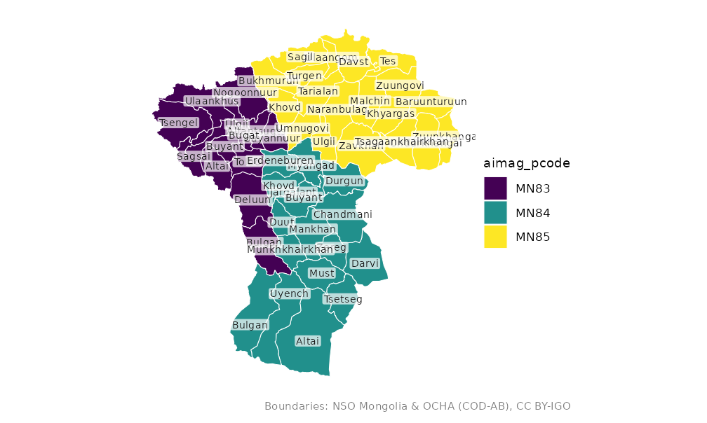
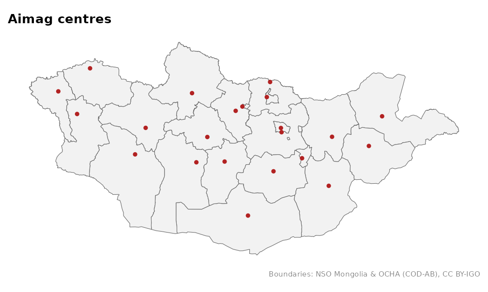
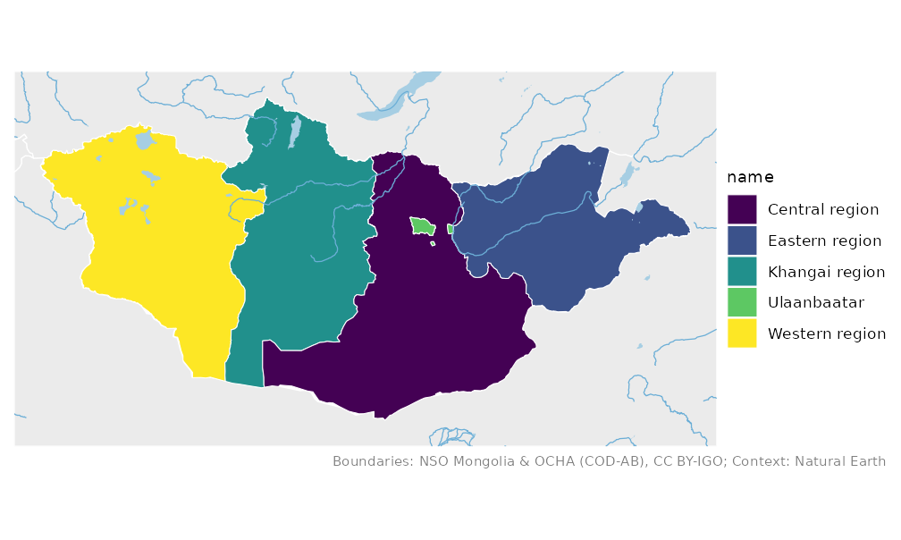
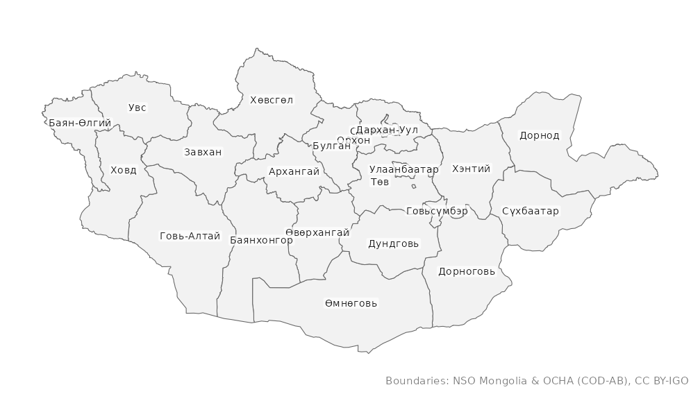

# Getting started with mongolmaps

mongolmaps gives you ready-made maps of Mongolia. Everything in this
vignette works offline: simplified boundaries ship with the package.

``` r

library(mongolmaps)
```

## Administrative levels

Mongolia has 21 aimags (provinces) and the capital, Ulaanbaatar. Aimags
are divided into soums, and soums into bags. Ulaanbaatar is divided into
9 districts (duureg) and those into khoroos.

| Level in mongolmaps | Rural units        | Ulaanbaatar units      |
|---------------------|--------------------|------------------------|
| `"country"`         | Mongolia           |                        |
| `"region"`          | 4 economic regions | Ulaanbaatar is the 5th |
| `"aimag"`           | 21 aimags          | Ulaanbaatar            |
| `"soum"`            | 330 soums          | 9 districts            |
| `"bag"`             | ~1,650 bags        | 204 khoroos            |

Each level has a function:

``` r

mn_aimags()
#> Simple feature collection with 22 features and 15 fields
#> Geometry type: MULTIPOLYGON
#> Dimension:     XY
#> Bounding box:  xmin: 87.7345 ymin: 41.58183 xmax: 119.9315 ymax: 52.14835
#> Geodetic CRS:  WGS 84
#> # A tibble: 22 × 16
#>    pcode name      name_en name_mn name_mns level type  number iso_code nso_code
#>    <chr> <chr>     <chr>   <chr>   <chr>    <chr> <chr>  <int> <chr>    <chr>   
#>  1 MN11  Ulaanbaa… Ulaanb… Улаанб… Ulaanba… aimag capi…     NA MN-1     511     
#>  2 MN21  Dornod    Dornod  Дорнод  Dornod   aimag aimag     NA MN-061   421     
#>  3 MN22  Sukhbaat… Sukhba… Сүхбаа… Sükhbaa… aimag aimag     NA MN-051   422     
#>  4 MN23  Khentii   Khentii Хэнтий  Khentii  aimag aimag     NA MN-039   423     
#>  5 MN41  Tuv       Tuv     Төв     Töv      aimag aimag     NA MN-047   341     
#>  6 MN42  Govisumb… Govisu… Говьсү… Govisüm… aimag aimag     NA MN-064   342     
#>  7 MN43  Selenge   Selenge Сэлэнгэ Selenge  aimag aimag     NA MN-049   343     
#>  8 MN44  Dornogovi Dornog… Дорног… Dornogo… aimag aimag     NA MN-063   344     
#>  9 MN45  Darkhan-… Darkha… Дархан… Darkhan… aimag aimag     NA MN-037   345     
#> 10 MN46  Umnugovi  Umnugo… Өмнөго… Ömnögovi aimag aimag     NA MN-053   346     
#> # ℹ 12 more rows
#> # ℹ 6 more variables: parent_pcode <chr>, region_pcode <chr>,
#> #   aimag_pcode <chr>, soum_pcode <chr>, area_km2 <dbl>,
#> #   geometry <MULTIPOLYGON [°]>
```

All of them return the same columns:

- `pcode`: a code that identifies the unit at any level;
- `name`, `name_en`, `name_mn`, `name_mns`: the name in the chosen
  language, in English (as NSO writes it), in Cyrillic, and in Latin
  with diacritics;
- `level`, `type`, `number`: what kind of unit it is;
- `iso_code`, `nso_code`: ISO 3166-2 and NSO statistical codes;
- `parent_pcode`, `region_pcode`, `aimag_pcode`, `soum_pcode`: the units
  it sits in;
- `area_km2` and the `geometry`.

## Filtering

Pass the places you want. Names can be spelled any common way.

``` r

mn_soums(aimag = "Khovd")
#> Simple feature collection with 17 features and 15 fields
#> Geometry type: MULTIPOLYGON
#> Dimension:     XY
#> Bounding box:  xmin: 90.65037 ymin: 44.99983 xmax: 94.30692 ymax: 48.96636
#> Geodetic CRS:  WGS 84
#> # A tibble: 17 × 16
#>    pcode  name     name_en name_mn name_mns level type  number iso_code nso_code
#>    <chr>  <chr>    <chr>   <chr>   <chr>    <chr> <chr>  <int> <chr>    <chr>   
#>  1 MN8401 Jargala… Jargal… Жаргал… Jargala… soum  soum      NA NA       18401   
#>  2 MN8404 Altai    Altai   Алтай   Altai    soum  soum      NA NA       18404   
#>  3 MN8407 Bulgan   Bulgan  Булган  Bulgan   soum  soum      NA NA       18407   
#>  4 MN8410 Buyant   Buyant  Буянт   Buyant   soum  soum      NA NA       18410   
#>  5 MN8413 Darvi    Darvi   Дарви   Darvi    soum  soum      NA NA       18413   
#>  6 MN8416 Durgun   Durgun  Дөргөн  Dörgön   soum  soum      NA NA       18416   
#>  7 MN8419 Duut     Duut    Дуут    Duut     soum  soum      NA NA       18419   
#>  8 MN8422 Zereg    Zereg   Зэрэг   Zereg    soum  soum      NA NA       18422   
#>  9 MN8425 Mankhan  Mankhan Манхан  Mankhan  soum  soum      NA NA       18425   
#> 10 MN8428 Munkhkh… Munkhk… Мөнхха… Mönkhkh… soum  soum      NA NA       18428   
#> 11 MN8431 Must     Must    Мөст    Möst     soum  soum      NA NA       18431   
#> 12 MN8434 Myangad  Myangad Мянгад  Myangad  soum  soum      NA NA       18434   
#> 13 MN8437 Uyench   Uyench  Үенч    Üyench   soum  soum      NA NA       18437   
#> 14 MN8440 Khovd    Khovd   Ховд    Khovd    soum  soum      NA NA       18440   
#> 15 MN8443 Tsetseg  Tsetseg Цэцэг   Tsetseg  soum  soum      NA NA       18443   
#> 16 MN8446 Chandma… Chandm… Чандма… Chandma… soum  soum      NA NA       18446   
#> 17 MN8449 Erdeneb… Erdene… Эрдэнэ… Erdeneb… soum  soum      NA NA       18449   
#> # ℹ 6 more variables: parent_pcode <chr>, region_pcode <chr>,
#> #   aimag_pcode <chr>, soum_pcode <chr>, area_km2 <dbl>,
#> #   geometry <MULTIPOLYGON [°]>
mn_aimags(region = "Western")
#> Simple feature collection with 5 features and 15 fields
#> Geometry type: MULTIPOLYGON
#> Dimension:     XY
#> Bounding box:  xmin: 87.7345 ymin: 42.69975 xmax: 99.20735 ymax: 50.88443
#> Geodetic CRS:  WGS 84
#> # A tibble: 5 × 16
#>   pcode name       name_en name_mn name_mns level type  number iso_code nso_code
#>   <chr> <chr>      <chr>   <chr>   <chr>    <chr> <chr>  <int> <chr>    <chr>   
#> 1 MN81  Zavkhan    Zavkhan Завхан  Zavkhan  aimag aimag     NA MN-057   181     
#> 2 MN82  Govi-Altai Govi-A… Говь-А… Govi-Al… aimag aimag     NA MN-065   182     
#> 3 MN83  Bayan-Ulg… Bayan-… Баян-Ө… Bayan-Ö… aimag aimag     NA MN-071   183     
#> 4 MN84  Khovd      Khovd   Ховд    Khovd    aimag aimag     NA MN-043   184     
#> 5 MN85  Uvs        Uvs     Увс     Uvs      aimag aimag     NA MN-046   185     
#> # ℹ 6 more variables: parent_pcode <chr>, region_pcode <chr>,
#> #   aimag_pcode <chr>, soum_pcode <chr>, area_km2 <dbl>,
#> #   geometry <MULTIPOLYGON [°]>
```

## Drawing maps

[`mn_map()`](https://temuulene.github.io/mongolmaps/reference/mn_map.md)
draws any of these with ggplot2.

``` r

mn_map(mn_soums(aimag = c("Khovd", "Uvs", "Bayan-Ulgii")), fill = aimag_pcode, label = TRUE)
```



It returns a normal ggplot, so you can keep adding to it:

``` r

library(ggplot2)
mn_map(mn_aimags()) +
  geom_sf(data = mn_settlements(type = c("capital", "aimag_centre")), colour = "firebrick") +
  labs(title = "Aimag centres")
```



With `context = TRUE` you get neighbouring countries, rivers and lakes:

``` r

mn_map(mn_regions(), fill = name, context = TRUE)
```



## Projections

Boundaries come in longitude and latitude (EPSG:4326).
[`mn_map()`](https://temuulene.github.io/mongolmaps/reference/mn_map.md)
projects them for you; to project them yourself use `crs`:

``` r

mn_aimags(crs = "albers")
#> Simple feature collection with 22 features and 15 fields
#> Geometry type: MULTIPOLYGON
#> Dimension:     XY
#> Bounding box:  xmin: -1182877 ymin: -601751.4 xmax: 1207275 ymax: 584211.5
#> Projected CRS: +proj=aea +lat_0=47 +lon_0=104 +lat_1=43.5 +lat_2=50.5 +x_0=0 +y_0=0 +datum=WGS84 +units=m +no_defs
#> # A tibble: 22 × 16
#>    pcode name      name_en name_mn name_mns level type  number iso_code nso_code
#>  * <chr> <chr>     <chr>   <chr>   <chr>    <chr> <chr>  <int> <chr>    <chr>   
#>  1 MN11  Ulaanbaa… Ulaanb… Улаанб… Ulaanba… aimag capi…     NA MN-1     511     
#>  2 MN21  Dornod    Dornod  Дорнод  Dornod   aimag aimag     NA MN-061   421     
#>  3 MN22  Sukhbaat… Sukhba… Сүхбаа… Sükhbaa… aimag aimag     NA MN-051   422     
#>  4 MN23  Khentii   Khentii Хэнтий  Khentii  aimag aimag     NA MN-039   423     
#>  5 MN41  Tuv       Tuv     Төв     Töv      aimag aimag     NA MN-047   341     
#>  6 MN42  Govisumb… Govisu… Говьсү… Govisüm… aimag aimag     NA MN-064   342     
#>  7 MN43  Selenge   Selenge Сэлэнгэ Selenge  aimag aimag     NA MN-049   343     
#>  8 MN44  Dornogovi Dornog… Дорног… Dornogo… aimag aimag     NA MN-063   344     
#>  9 MN45  Darkhan-… Darkha… Дархан… Darkhan… aimag aimag     NA MN-037   345     
#> 10 MN46  Umnugovi  Umnugo… Өмнөго… Ömnögovi aimag aimag     NA MN-053   346     
#> # ℹ 12 more rows
#> # ℹ 6 more variables: parent_pcode <chr>, region_pcode <chr>,
#> #   aimag_pcode <chr>, soum_pcode <chr>, area_km2 <dbl>,
#> #   geometry <MULTIPOLYGON [m]>
```

[`mn_crs()`](https://temuulene.github.io/mongolmaps/reference/mn_crs.md)
returns the projections: Albers equal-area for national maps, UTM zone
48N for Ulaanbaatar.

## Languages

``` r

mn_map(mn_aimags(lang = "mn"), label = TRUE, lang = "mn")
```



Set `options(mongolmaps.lang = "mn")` to use Mongolian everywhere.

## Higher resolution

The bundled boundaries are simplified. For detailed work, use
`resolution = "high"`: the full-resolution boundaries (about 10 MB) are
downloaded once and cached.

``` r

mn_soums(aimag = "Khovd", resolution = "high")
```

## Where the data come from

``` r

mn_sources()[c("id", "provider", "license")]
#> # A tibble: 16 × 3
#>    id             provider                                               license
#>    <chr>          <chr>                                                  <chr>  
#>  1 admin          National Statistics Office of Mongolia; OCHA           CC BY-…
#>  2 khoroos        khoroo-map (GitHub Tuvshin-Level/khoroo-map)           0BSD   
#>  3 codes          National Statistics Office of Mongolia                 Open d…
#>  4 settlements    Wikidata                                               CC0 1.0
#>  5 naturalearth   Natural Earth                                          Public…
#>  6 admin_high     National Statistics Office of Mongolia; OCHA; khoroo-… CC BY-…
#>  7 osm_roads      OpenStreetMap contributors (via HOT export)            ODbL 1…
#>  8 osm_transport  OpenStreetMap contributors (via HOT export)            ODbL 1…
#>  9 osm_water      OpenStreetMap contributors (via HOT export)            ODbL 1…
#> 10 osm_places     OpenStreetMap contributors (via HOT export)            ODbL 1…
#> 11 elevation_1km  Copernicus DEM GLO-90 (DLR; Airbus; ESA; European Uni… Copern…
#> 12 landcover_1km  ESA WorldCover project                                 CC BY …
#> 13 copernicus_dem Copernicus DEM GLO-90 (DLR; Airbus; ESA; European Uni… Copern…
#> 14 worldcover     ESA WorldCover project                                 CC BY …
#> 15 worldpop       WorldPop (University of Southampton)                   CC BY …
#> 16 wdpa           UNEP-WCMC and IUCN (Protected Planet)                  WDPA t…
```

Please credit the providers;
[`mn_citation()`](https://temuulene.github.io/mongolmaps/reference/mn_sources.md)
gives the text.
