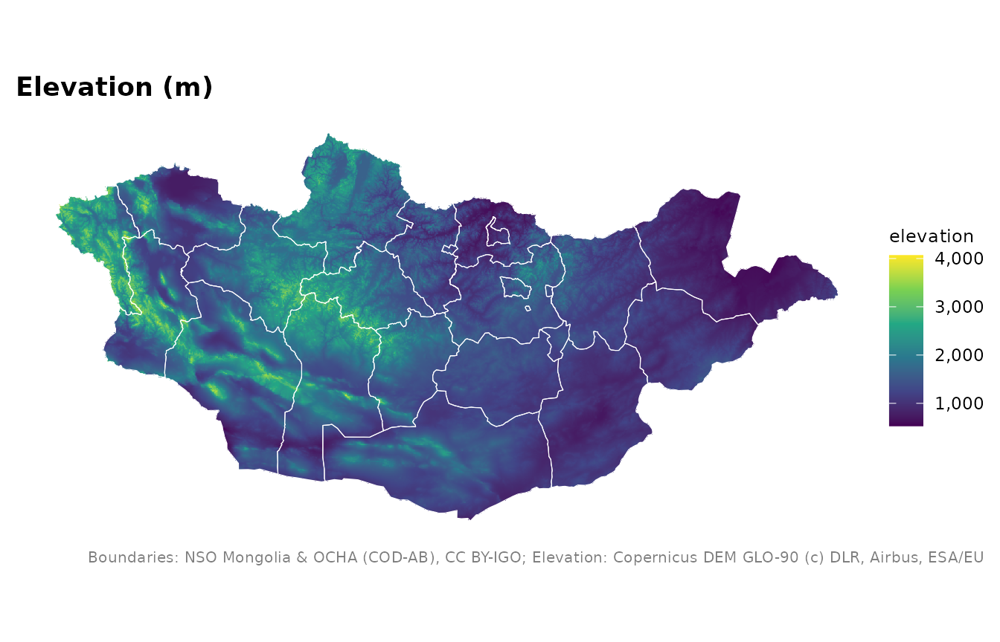
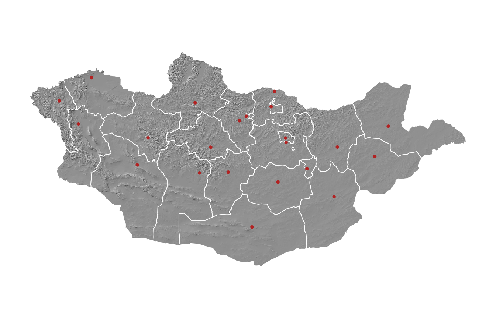
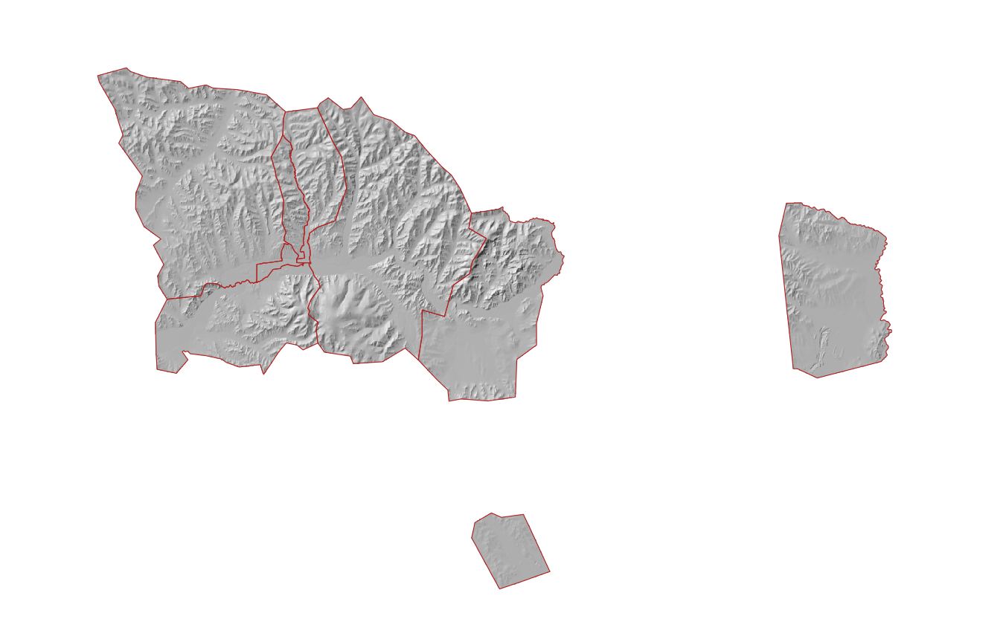
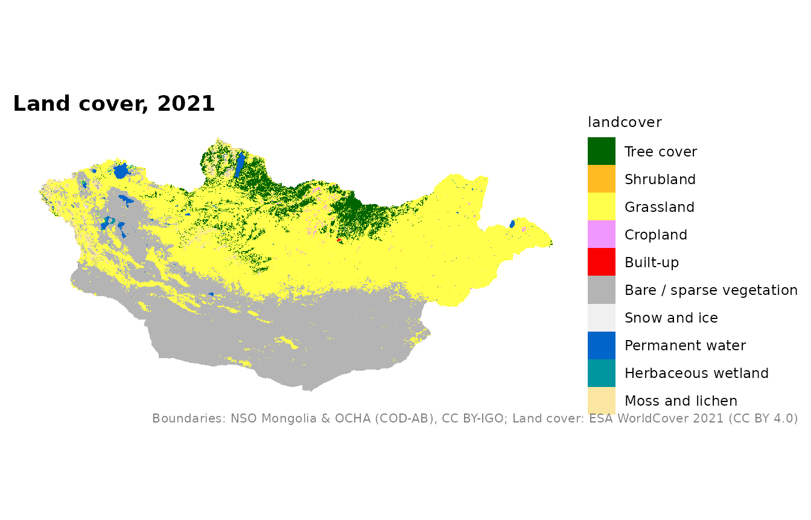
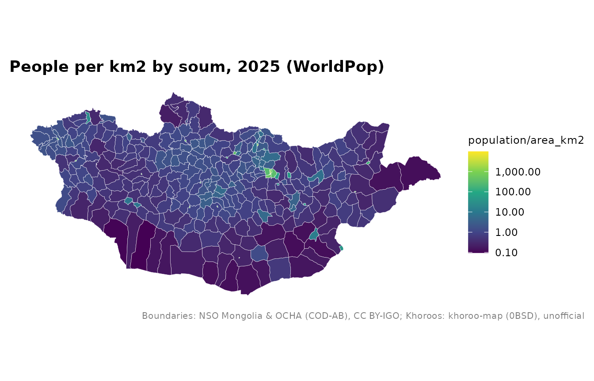
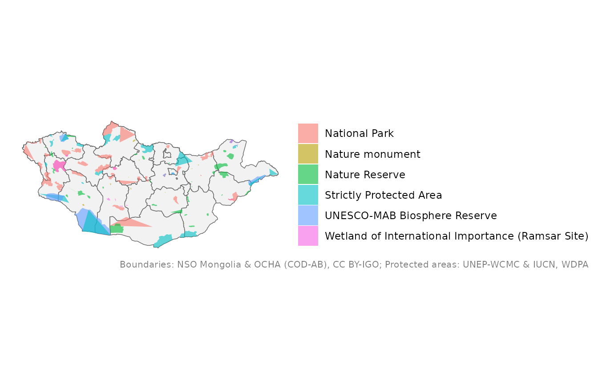

# Terrain, land cover, population and protected areas

``` r

library(mongolmaps)
library(ggplot2)
```

These layers are rasters (grids of cells), returned as `terra`
SpatRasters. National 1 km grids are downloaded once and cached; finer
grids are read directly from the cloud for one area at a time.

| Function | Resolutions | Source |
|----|----|----|
| [`mn_elevation()`](https://temuulene.github.io/mongolmaps/reference/mn_elevation.md), [`mn_hillshade()`](https://temuulene.github.io/mongolmaps/reference/mn_elevation.md) | 1 km (national), 90 m (by area) | Copernicus DEM GLO-90 |
| [`mn_landcover()`](https://temuulene.github.io/mongolmaps/reference/mn_landcover.md) | 1 km (national), 10 m (by area) | ESA WorldCover 2021 |
| [`mn_population()`](https://temuulene.github.io/mongolmaps/reference/mn_population.md) | 1 km, 100 m; years 2015 to 2030 | WorldPop |

[`mn_map()`](https://temuulene.github.io/mongolmaps/reference/mn_map.md)
draws rasters too, with the right colours and credits.

## Terrain

``` r

mn_map(mn_elevation(), title = "Elevation (m)") +
  geom_sf(data = mn_aimags(), fill = NA, colour = "white", linewidth = 0.2)
```



Shaded relief makes a good background under other layers:

``` r

mn_map(mn_hillshade(), caption = FALSE) +
  geom_sf(data = mn_aimags(), fill = NA, colour = "white", linewidth = 0.3) +
  geom_sf(data = mn_settlements(type = c("capital", "aimag_centre")), colour = "firebrick", size = 1)
```



For one area, 90 m detail:

``` r

mn_map(mn_hillshade("90m", within = "Ulaanbaatar"), caption = FALSE) +
  geom_sf(data = mn_ub_districts(), fill = NA, colour = "firebrick")
#> Warning: Raster pixels are placed at uneven horizontal intervals and will be shifted
#> ℹ Consider using `geom_tile()` instead.
#> Raster pixels are placed at uneven horizontal intervals and will be shifted
#> ℹ Consider using `geom_tile()` instead.
```



## Land cover

``` r

mn_map(mn_landcover(), title = "Land cover, 2021")
```



## Population

[`mn_zonal()`](https://temuulene.github.io/mongolmaps/reference/mn_zonal.md)
adds up the grid for any set of polygons, for example soums:

``` r

pop <- mn_population(2025)
soums <- mn_zonal(pop, mn_soums(), name = "population")
mn_map(soums, fill = population / area_km2, trans = "log10",
       title = "People per km2 by soum, 2025 (WorldPop)")
```



## Protected areas

The World Database on Protected Areas may not be redistributed, so it is
downloaded from UNEP-WCMC on first use:

``` r

pa <- mn_protected_areas()
mn_map(mn_aimags(), caption = FALSE) +
  geom_sf(data = pa, aes(fill = desig_eng), alpha = 0.6, colour = NA) +
  labs(fill = NULL, caption = mn_citation(c("admin", "wdpa")))
```


