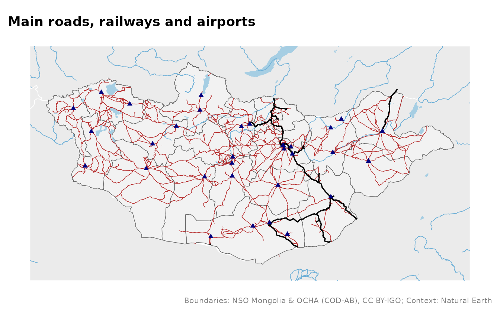
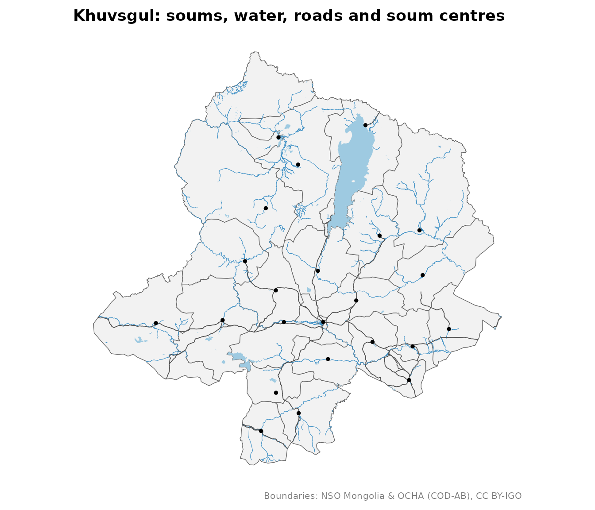
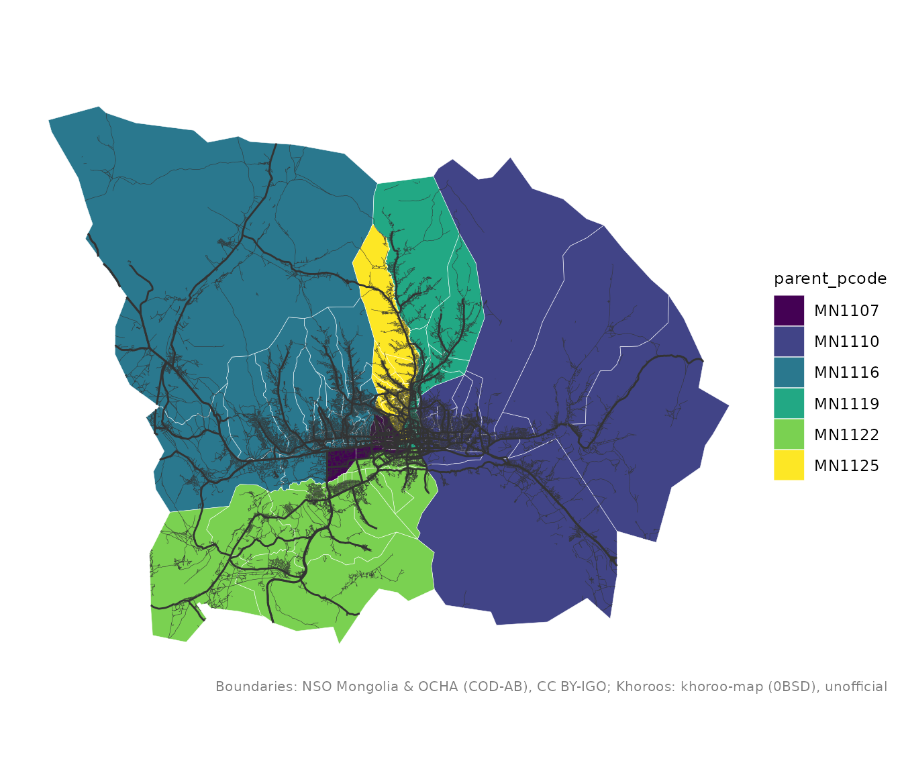

# Thematic layers: roads, water, places

``` r

library(mongolmaps)
library(ggplot2)
```

Besides boundaries, mongolmaps provides the layers that make a map
readable. Small ones ship with the package; larger ones are downloaded
once and cached (see
[`mn_cache_dir()`](https://temuulene.github.io/mongolmaps/reference/mn_cache_dir.md)).

| Function | What | Source | Delivery |
|----|----|----|----|
| [`mn_settlements()`](https://temuulene.github.io/mongolmaps/reference/mn_settlements.md) | capital, aimag and soum centres | Wikidata | bundled |
| [`mn_neighbours()`](https://temuulene.github.io/mongolmaps/reference/mn_neighbours.md) | Russia, China, Kazakhstan around Mongolia | Natural Earth | bundled |
| [`mn_rivers()`](https://temuulene.github.io/mongolmaps/reference/mn_neighbours.md), [`mn_lakes()`](https://temuulene.github.io/mongolmaps/reference/mn_neighbours.md) | major rivers and lakes | Natural Earth | bundled |
| `mn_rivers("all")`, `mn_lakes("all")` | every river, stream and water body | OpenStreetMap | download, ~20 MB |
| [`mn_roads()`](https://temuulene.github.io/mongolmaps/reference/mn_roads.md) | roads and streets | OpenStreetMap | download, ~30 MB |
| [`mn_railways()`](https://temuulene.github.io/mongolmaps/reference/mn_roads.md), [`mn_airports()`](https://temuulene.github.io/mongolmaps/reference/mn_roads.md) | railways, stations, airports | OpenStreetMap | download, \<1 MB |
| [`mn_places()`](https://temuulene.github.io/mongolmaps/reference/mn_roads.md) | cities, towns, villages | OpenStreetMap | download, \<1 MB |

## The country

``` r

mn_map(mn_aimags(), context = TRUE) +
  geom_sf(data = mn_roads(), colour = "firebrick", linewidth = 0.25) +
  geom_sf(data = mn_railways(), colour = "black", linewidth = 0.6) +
  geom_sf(data = mn_airports(), shape = 17, colour = "navy") +
  labs(title = "Main roads, railways and airports")
```



## One aimag

`within` keeps the features inside a place and cuts lines at its border:

``` r

aimag <- "Khuvsgul"
mn_map(mn_soums(aimag = aimag)) +
  geom_sf(data = mn_lakes("all", within = aimag), fill = "#9ecae1", colour = NA) +
  geom_sf(data = mn_rivers("all", within = aimag), colour = "#4292c6", linewidth = 0.2) +
  geom_sf(data = mn_roads(within = aimag), colour = "grey30", linewidth = 0.3) +
  geom_sf(data = mn_settlements(within = aimag), size = 1) +
  labs(title = "Khuvsgul: soums, water, roads and soum centres")
```



## Ulaanbaatar streets

``` r

central <- c("BGD", "BZD", "ChD", "KhUD", "SKhD", "SBD")
streets <- mn_roads(class = c("main", "minor"), within = central)
#> Re-reading with feature count reset from 34522 to 34521
mn_map(mn_khoroos(district = central), fill = parent_pcode) +
  geom_sf(data = streets, aes(linewidth = class), colour = "grey20") +
  scale_linewidth_manual(values = c(main = 0.5, minor = 0.1), guide = "none")
```



## Credits

OpenStreetMap layers are under the Open Database Licence. Credit them
when you publish:

``` r

mn_citation(c("admin", "osm_roads", "osm_water"))
#> [1] "Boundaries: NSO Mongolia & OCHA (COD-AB), CC BY-IGO; Roads: (c) OpenStreetMap contributors, ODbL; Water: (c) OpenStreetMap contributors, ODbL"
```
