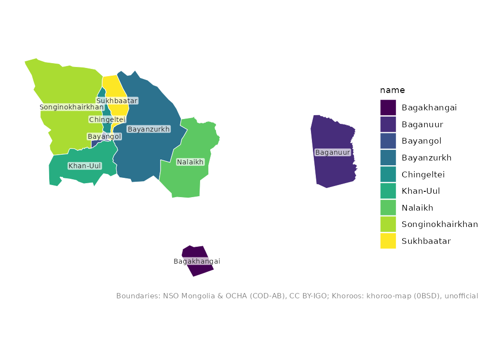
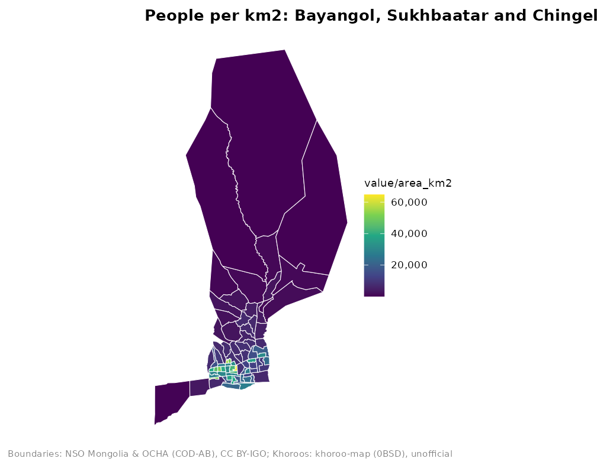

# Maps of Ulaanbaatar

``` r

library(mongolmaps)
```

Ulaanbaatar has three map levels: the city, its 9 districts (duureg) and
its 204 khoroos. The layers fit together exactly.

``` r

mn_ub()
#> Simple feature collection with 1 feature and 15 fields
#> Geometry type: MULTIPOLYGON
#> Dimension:     XY
#> Bounding box:  xmin: 106.3626 ymin: 47.30196 xmax: 108.5008 ymax: 48.27193
#> Geodetic CRS:  WGS 84
#> # A tibble: 1 × 16
#>   pcode name       name_en name_mn name_mns level type  number iso_code nso_code
#>   <chr> <chr>      <chr>   <chr>   <chr>    <chr> <chr>  <int> <chr>    <chr>   
#> 1 MN11  Ulaanbaat… Ulaanb… Улаанб… Ulaanba… aimag capi…     NA MN-1     511     
#> # ℹ 6 more variables: parent_pcode <chr>, region_pcode <chr>,
#> #   aimag_pcode <chr>, soum_pcode <chr>, area_km2 <dbl>,
#> #   geometry <MULTIPOLYGON [°]>
mn_ub_districts()
#> Simple feature collection with 9 features and 15 fields
#> Geometry type: MULTIPOLYGON
#> Dimension:     XY
#> Bounding box:  xmin: 106.3626 ymin: 47.30196 xmax: 108.5008 ymax: 48.27193
#> Geodetic CRS:  WGS 84
#> # A tibble: 9 × 16
#>   pcode  name      name_en name_mn name_mns level type  number iso_code nso_code
#>   <chr>  <chr>     <chr>   <chr>   <chr>    <chr> <chr>  <int> <chr>    <chr>   
#> 1 MN1101 Baganuur  Baganu… Багану… Baganuur soum  dist…     NA NA       51101   
#> 2 MN1104 Bagakhan… Bagakh… Багаха… Bagakha… soum  dist…     NA NA       51104   
#> 3 MN1107 Bayangol  Bayang… Баянгол Bayangol soum  dist…     NA NA       51107   
#> 4 MN1110 Bayanzur… Bayanz… Баянзү… Bayanzü… soum  dist…     NA NA       51110   
#> 5 MN1113 Nalaikh   Nalaikh Налайх  Nalaikh  soum  dist…     NA NA       51113   
#> 6 MN1116 Songinok… Songin… Сонгин… Songino… soum  dist…     NA NA       51116   
#> 7 MN1119 Sukhbaat… Sukhba… Сүхбаа… Sükhbaa… soum  dist…     NA NA       51119   
#> 8 MN1122 Khan-Uul  Khan-U… Хан-Уул Khan-Uul soum  dist…     NA NA       51122   
#> 9 MN1125 Chingelt… Chinge… Чингэл… Chingel… soum  dist…     NA NA       51125   
#> # ℹ 6 more variables: parent_pcode <chr>, region_pcode <chr>,
#> #   aimag_pcode <chr>, soum_pcode <chr>, area_km2 <dbl>,
#> #   geometry <MULTIPOLYGON [°]>
mn_khoroos()
#> Simple feature collection with 204 features and 15 fields
#> Geometry type: MULTIPOLYGON
#> Dimension:     XY
#> Bounding box:  xmin: 106.3626 ymin: 47.30196 xmax: 108.5008 ymax: 48.27193
#> Geodetic CRS:  WGS 84
#> # A tibble: 204 × 16
#>    pcode    name   name_en name_mn name_mns level type  number iso_code nso_code
#>    <chr>    <chr>  <chr>   <chr>   <chr>    <chr> <chr>  <int> <chr>    <chr>   
#>  1 MN110151 1-r k… 1-r kh… 1-р хо… 1-r kho… bag   khor…      1 NA       5110151 
#>  2 MN110153 2-r k… 2-r kh… 2-р хо… 2-r kho… bag   khor…      2 NA       5110153 
#>  3 MN110155 3-r k… 3-r kh… 3-р хо… 3-r kho… bag   khor…      3 NA       5110155 
#>  4 MN110157 4-r k… 4-r kh… 4-р хо… 4-r kho… bag   khor…      4 NA       5110157 
#>  5 MN110159 5-r k… 5-r kh… 5-р хо… 5-r kho… bag   khor…      5 NA       5110159 
#>  6 MN110451 1-r k… 1-r kh… 1-р хо… 1-r kho… bag   khor…      1 NA       5110451 
#>  7 MN110453 2-r k… 2-r kh… 2-р хо… 2-r kho… bag   khor…      2 NA       5110453 
#>  8 MN110751 1-r k… 1-r kh… 1-р хо… 1-r kho… bag   khor…      1 NA       5110751 
#>  9 MN110752 26-r … 26-r k… 26-р х… 26-r kh… bag   khor…     26 NA       5110752 
#> 10 MN110753 2-r k… 2-r kh… 2-р хо… 2-r kho… bag   khor…      2 NA       5110753 
#> # ℹ 194 more rows
#> # ℹ 6 more variables: parent_pcode <chr>, region_pcode <chr>,
#> #   aimag_pcode <chr>, soum_pcode <chr>, area_km2 <dbl>,
#> #   geometry <MULTIPOLYGON [°]>
```

## Districts

``` r

mn_map(mn_ub_districts(), fill = name, label = TRUE)
```



Baganuur and Bagakhangai are exclaves, far to the east and south-east of
the main city. To focus on the city centre, keep the districts you need:

``` r

central <- c("Bayangol", "Bayanzurkh", "Chingeltei", "Khan-Uul", "Songinokhairkhan", "Sukhbaatar")
mn_map(mn_khoroos(district = central), fill = parent_pcode)
```


District names accept common abbreviations such as `"BZD"`, `"SBD"` or
`"KhUD"`, and Cyrillic:

``` r

mn_khoroos(district = "\u0411\u0417\u0414")
#> Simple feature collection with 43 features and 15 fields
#> Geometry type: MULTIPOLYGON
#> Dimension:     XY
#> Bounding box:  xmin: 106.9215 ymin: 47.72161 xmax: 107.4114 ymax: 48.20897
#> Geodetic CRS:  WGS 84
#> # A tibble: 43 × 16
#>    pcode    name   name_en name_mn name_mns level type  number iso_code nso_code
#>    <chr>    <chr>  <chr>   <chr>   <chr>    <chr> <chr>  <int> <chr>    <chr>   
#>  1 MN111051 1-r k… 1-r kh… 1-р хо… 1-r kho… bag   khor…      1 NA       5111051 
#>  2 MN111052 26-r … 26-r k… 26-р х… 26-r kh… bag   khor…     26 NA       5111052 
#>  3 MN111053 2-r k… 2-r kh… 2-р хо… 2-r kho… bag   khor…      2 NA       5111053 
#>  4 MN111054 27-r … 27-r k… 27-р х… 27-r kh… bag   khor…     27 NA       5111054 
#>  5 MN111055 3-r k… 3-r kh… 3-р хо… 3-r kho… bag   khor…      3 NA       5111055 
#>  6 MN111056 28-r … 28-r k… 28-р х… 28-r kh… bag   khor…     28 NA       5111056 
#>  7 MN111057 4-r k… 4-r kh… 4-р хо… 4-r kho… bag   khor…      4 NA       5111057 
#>  8 MN111058 29-r … 29-r k… 29-р х… 29-r kh… bag   khor…     29 NA       5111058 
#>  9 MN111059 5-r k… 5-r kh… 5-р хо… 5-r kho… bag   khor…      5 NA       5111059 
#> 10 MN111060 30-r … 30-r k… 30-р х… 30-r kh… bag   khor…     30 NA       5111060 
#> # ℹ 33 more rows
#> # ℹ 6 more variables: parent_pcode <chr>, region_pcode <chr>,
#> #   aimag_pcode <chr>, soum_pcode <chr>, area_km2 <dbl>,
#> #   geometry <MULTIPOLYGON [°]>
```

## Khoroos

Khoroos are numbered within their district; the number is in the
`number` column, and `mn_map(label = TRUE)` shows it.

``` r

mn_map(mn_khoroos(district = "Sukhbaatar"), fill = area_km2, label = TRUE)
```


To find one khoroo, use
[`mn_match()`](https://temuulene.github.io/mongolmaps/reference/mn_match.md)
with the district:

``` r

mn_match("15-r khoroo", level = "bag", within = "Bayangol")
#> [1] "MN110779"
mn_match("Bayangol 15")
#> [1] "MN110779"
```

## Joining statistics

NSO publishes many statistics by khoroo. The example data has the
mid-year population:

``` r

pop <- mn_example_population[mn_example_population$Year == 2025, ]
khoroo_pop <- mn_join(pop, by = "Region", level = "bag", within = "Ulaanbaatar")
#> ℹ Joining at the bag level; dropped 371 rows for larger units ("country",
#>   "region", "aimag", and "soum").

mn_map(
  khoroo_pop[khoroo_pop$parent_pcode %in% c("MN1107", "MN1119", "MN1125"), ],
  fill = value / area_km2,
  title = "People per km2: Bayangol, Sukhbaatar and Chingeltei"
)
```



## Interactive maps

``` r

mn_leaflet(khoroo_pop, fill = value)
```

## About the khoroo boundaries

The khoroo boundaries come from the open khoroo-map project, which does
not state where its data come from, so treat them as **unofficial**.
They were fitted to the official Ulaanbaatar outline; the district
boundaries in
[`mn_ub_districts()`](https://temuulene.github.io/mongolmaps/reference/mn_ub.md)
are the unions of their khoroos and follow the current city layout. See
[`?mn_khoroos`](https://temuulene.github.io/mongolmaps/reference/mn_ub.md)
for details.
