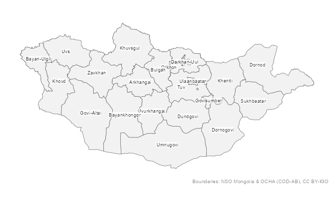
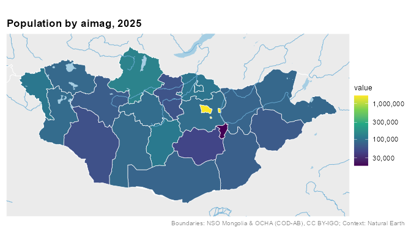
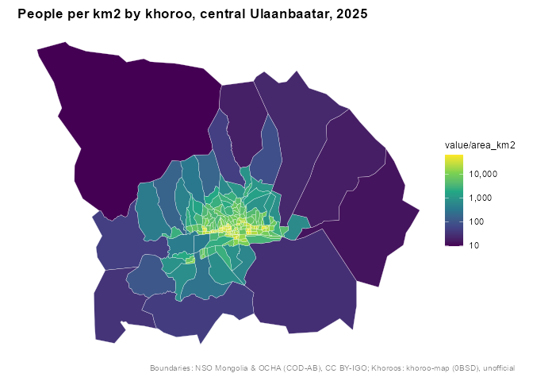
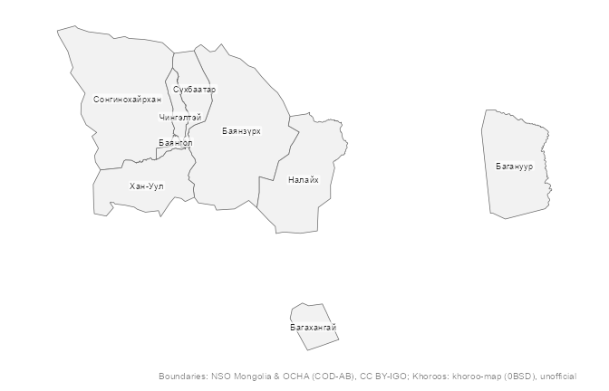

# mongolmaps

**Maps of Mongolia and Ulaanbaatar for R, at every openly available
administrative level.** One package, no downloads to start, and names
that match however you spell them.

| Level | Function | Units |
|----|----|----|
| Country | [`mn_country()`](https://temuulene.github.io/mongolmaps/reference/mn_country.md) | 1 |
| Economic regions | [`mn_regions()`](https://temuulene.github.io/mongolmaps/reference/mn_country.md) | 5 |
| Aimags (provinces) and the capital | [`mn_aimags()`](https://temuulene.github.io/mongolmaps/reference/mn_aimags.md) | 22 |
| Soums and Ulaanbaatar districts | [`mn_soums()`](https://temuulene.github.io/mongolmaps/reference/mn_soums.md), [`mn_ub_districts()`](https://temuulene.github.io/mongolmaps/reference/mn_ub.md) | 330 + 9 |
| Ulaanbaatar khoroos | [`mn_khoroos()`](https://temuulene.github.io/mongolmaps/reference/mn_ub.md) | 204 |
| Bags | [`mn_bags()`](https://temuulene.github.io/mongolmaps/reference/mn_bags.md) | codes and names of all ~1,650; boundaries from NSO on request |

Every function returns an `sf` table with the same columns (codes,
English and Mongolian names, parent units, area), so maps at different
levels work the same way.

## Installation

``` r

# install.packages("pak")
pak::pak("temuulene/mongolmaps")
```

## Your first map

``` r

library(mongolmaps)

mn_map(label = TRUE)
```



[`mn_map()`](https://temuulene.github.io/mongolmaps/reference/mn_map.md)
picks a projection suited to Mongolia, labels places inside their
borders and credits the data source.

## Your data on a map

[`mn_join()`](https://temuulene.github.io/mongolmaps/reference/mn_join.md)
attaches a data frame to the boundaries. The place column can use any
spelling, Cyrillic, or the codes used in National Statistics Office
(NSO) tables. Totals and other levels in NSO tables are dropped for you.

``` r

pop <- mn_example_population[mn_example_population$Year == 2025, ]

pop_map <- mn_join(pop, by = "Region", level = "aimag")
#> ℹ Joining at the aimag level; dropped 6 rows for larger units ("country" and
#>   "region") and 2196 rows for smaller units ("soum" and "bag").

mn_map(pop_map, fill = value, trans = "log10", context = TRUE,
       title = "Population by aimag, 2025")
```



## Ulaanbaatar down to khoroos

``` r

# The six central districts, by their usual abbreviations
central <- c("BGD", "BZD", "ChD", "KhUD", "SKhD", "SBD")
khoroo_pop <- mn_join(pop, by = "Region", level = "bag", within = central)
#> ℹ Joining at the bag level; dropped 371 rows for larger units ("country",
#>   "region", "aimag", and "soum").

mn_map(khoroo_pop, fill = value / area_km2, trans = "log10",
       title = "People per km2 by khoroo, central Ulaanbaatar, 2025")
```



Khoroos are labelled with their number; districts and other units with
their name, in English or Mongolian:

``` r

mn_map(mn_ub_districts(), label = TRUE, lang = "mn")
```



## Names in any spelling

``` r

mn_match(c("Khuvsgul", "Hovsgol", "Khövsgöl", "Хөвсгөл", "MN-041", "267"))
#> [1] "MN67" "MN67" "MN67" "MN67" "MN67" "MN67"

mn_match("Sukhbaatar district")
#> [1] "MN1119"
mn_match("Bayan-Uul", level = "soum", within = "Dornod")
#> [1] "MN2110"

mn_codes("soum", within = "Khovd")
#> # A tibble: 17 × 16
#>    pcode  name     name_en name_mn name_mns level type  number iso_code nso_code
#>    <chr>  <chr>    <chr>   <chr>   <chr>    <chr> <chr>  <int> <chr>    <chr>   
#>  1 MN8401 Jargala… Jargal… Жаргал… Jargala… soum  soum      NA <NA>     18401   
#>  2 MN8404 Altai    Altai   Алтай   Altai    soum  soum      NA <NA>     18404   
#>  3 MN8407 Bulgan   Bulgan  Булган  Bulgan   soum  soum      NA <NA>     18407   
#>  4 MN8410 Buyant   Buyant  Буянт   Buyant   soum  soum      NA <NA>     18410   
#>  5 MN8413 Darvi    Darvi   Дарви   Darvi    soum  soum      NA <NA>     18413   
#>  6 MN8416 Durgun   Durgun  Дөргөн  Dörgön   soum  soum      NA <NA>     18416   
#>  7 MN8419 Duut     Duut    Дуут    Duut     soum  soum      NA <NA>     18419   
#>  8 MN8422 Zereg    Zereg   Зэрэг   Zereg    soum  soum      NA <NA>     18422   
#>  9 MN8425 Mankhan  Mankhan Манхан  Mankhan  soum  soum      NA <NA>     18425   
#> 10 MN8428 Munkhkh… Munkhk… Мөнхха… Mönkhkh… soum  soum      NA <NA>     18428   
#> 11 MN8431 Must     Must    Мөст    Möst     soum  soum      NA <NA>     18431   
#> 12 MN8434 Myangad  Myangad Мянгад  Myangad  soum  soum      NA <NA>     18434   
#> 13 MN8437 Uyench   Uyench  Үенч    Üyench   soum  soum      NA <NA>     18437   
#> 14 MN8440 Khovd    Khovd   Ховд    Khovd    soum  soum      NA <NA>     18440   
#> 15 MN8443 Tsetseg  Tsetseg Цэцэг   Tsetseg  soum  soum      NA <NA>     18443   
#> 16 MN8446 Chandma… Chandm… Чандма… Chandma… soum  soum      NA <NA>     18446   
#> 17 MN8449 Erdeneb… Erdene… Эрдэнэ… Erdeneb… soum  soum      NA <NA>     18449   
#> # ℹ 6 more variables: parent_pcode <chr>, region_pcode <chr>,
#> #   aimag_pcode <chr>, soum_pcode <chr>, area_km2 <dbl>, has_geometry <lgl>
```

## More

- Interactive maps: `mn_leaflet(mn_khoroos(), fill = area_km2)`.
- Labels in Mongolian: `lang = "mn"` in any function, or
  `options(mongolmaps.lang = "mn")`.
- Full-resolution boundaries: `resolution = "high"` (downloaded once and
  cached).
- Settlements, rivers, lakes and neighbouring countries:
  [`mn_settlements()`](https://temuulene.github.io/mongolmaps/reference/mn_settlements.md),
  [`mn_rivers()`](https://temuulene.github.io/mongolmaps/reference/mn_neighbours.md),
  [`mn_lakes()`](https://temuulene.github.io/mongolmaps/reference/mn_neighbours.md),
  [`mn_neighbours()`](https://temuulene.github.io/mongolmaps/reference/mn_neighbours.md).
- Roads, railways, airports and places from OpenStreetMap:
  `mn_roads(within = "Ulaanbaatar")`,
  [`mn_railways()`](https://temuulene.github.io/mongolmaps/reference/mn_roads.md),
  [`mn_airports()`](https://temuulene.github.io/mongolmaps/reference/mn_roads.md),
  [`mn_places()`](https://temuulene.github.io/mongolmaps/reference/mn_roads.md)
  (downloaded once and cached).
- Elevation, hillshade, land cover and population grids (with terra):
  `mn_map(mn_elevation())`,
  [`mn_landcover()`](https://temuulene.github.io/mongolmaps/reference/mn_landcover.md),
  `mn_population(2025)`, and
  [`mn_zonal()`](https://temuulene.github.io/mongolmaps/reference/mn_zonal.md)
  to sum them by aimag, soum or khoroo.
- Protected areas:
  [`mn_protected_areas()`](https://temuulene.github.io/mongolmaps/reference/mn_protected_areas.md).
- Small multiples: `mn_aimag_grid` for
  [`geofacet::facet_geo()`](https://hafen.github.io/geofacet/reference/facet_geo.html).

## Data sources

| title | provider | license |
|:---|:---|:---|
| Administrative boundaries (country to soum) | National Statistics Office of Mongolia; OCHA | CC BY-IGO 3.0 |
| Ulaanbaatar khoroo boundaries | khoroo-map (GitHub Tuvshin-Level/khoroo-map) | 0BSD |
| Unit codes and names down to bag level | National Statistics Office of Mongolia | Open data (NSO) |
| Capital, aimag and soum centres | Wikidata | CC0 1.0 |
| Neighbouring countries, major rivers and lakes | Natural Earth | Public domain |
| Full-resolution administrative boundaries | National Statistics Office of Mongolia; OCHA; khoroo-map | CC BY-IGO 3.0; 0BSD (khoroos) |
| Roads and streets (OpenStreetMap) | OpenStreetMap contributors (via HOT export) | ODbL 1.0 |
| Railways, stations and airports (OpenStreetMap) | OpenStreetMap contributors (via HOT export) | ODbL 1.0 |
| Rivers, streams and water bodies (OpenStreetMap) | OpenStreetMap contributors (via HOT export) | ODbL 1.0 |
| Populated places (OpenStreetMap) | OpenStreetMap contributors (via HOT export) | ODbL 1.0 |
| Elevation, 1 km (Copernicus DEM) | Copernicus DEM GLO-90 (DLR; Airbus; ESA; European Union) | Copernicus DEM licence (free use with attribution) |
| Land cover, 1 km (ESA WorldCover 2021) | ESA WorldCover project | CC BY 4.0 |
| Elevation, 90 m (Copernicus DEM, read online) | Copernicus DEM GLO-90 (DLR; Airbus; ESA; European Union) | Copernicus DEM licence (free use with attribution) |
| Land cover, 10 m (ESA WorldCover 2021, read online) | ESA WorldCover project | CC BY 4.0 |
| Population grids 2015-2030 (WorldPop) | WorldPop (University of Southampton) | CC BY 4.0 |
| Protected areas (WDPA) | UNEP-WCMC and IUCN (Protected Planet) | WDPA terms (non-commercial; no redistribution) |

Khoroo boundaries come from an open project that does not state their
origin, so treat them as **unofficial**. Bag boundaries are not openly
published; see
[`?mn_bags`](https://temuulene.github.io/mongolmaps/reference/mn_bags.md)
for how to use them once you get them from NSO. Please credit the
providers when you publish maps:
[`mn_citation()`](https://temuulene.github.io/mongolmaps/reference/mn_sources.md)
returns the text, and
[`mn_map()`](https://temuulene.github.io/mongolmaps/reference/mn_map.md)
adds it as a caption.
