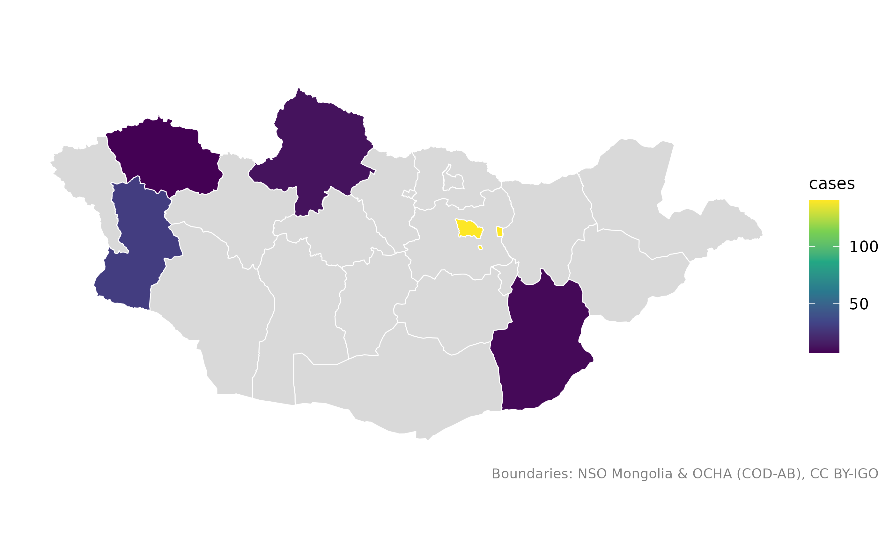
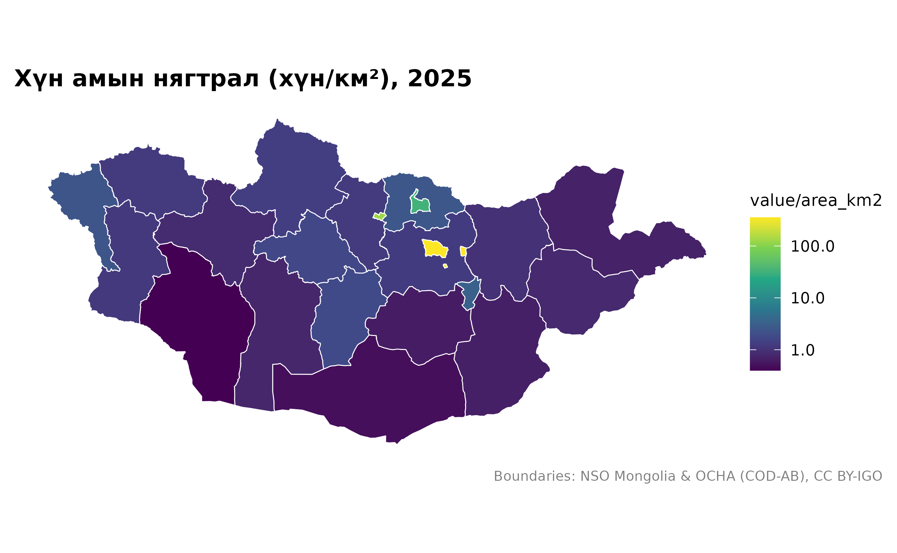
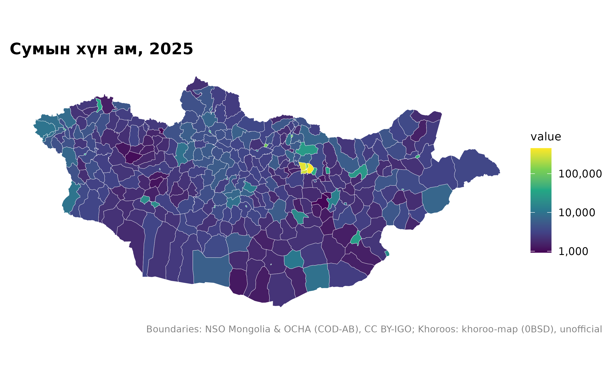
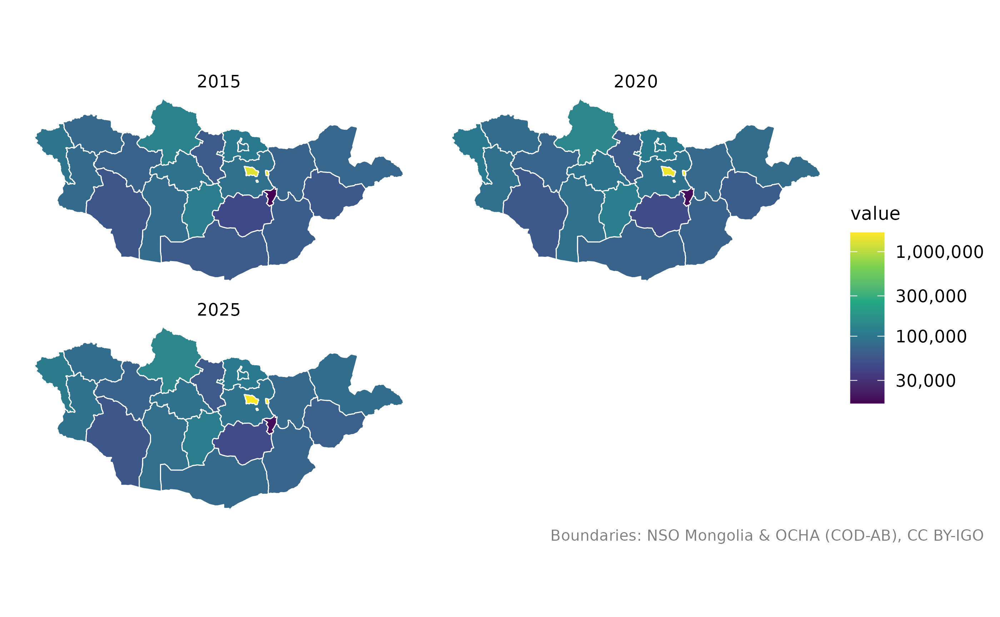

# Өөрийн өгөгдлөө газрын зураг дээр

``` r

library(mongolmaps)
options(mongolmaps.lang = "mn")
```

Ихэвчлэн гурван алхамтай: газар тус бүрт нэг мөртэй хүснэгт бэлтгэх,
[`mn_join()`](https://temuulene.github.io/mongolmaps/mn/reference/mn_join.md)-оор
хилтэй холбох,
[`mn_map()`](https://temuulene.github.io/mongolmaps/mn/reference/mn_map.md)-аар
зурах.

## Жижиг хүснэгт

Газрын нэрийг англи эсвэл кирилээр, ямар ч түгээмэл бичлэгээр бичиж
болно:

``` r

cases <- data.frame(
  aimag = c("Хөвсгөл", "Hovd", "Увс", "Ulan Bator", "Dornogobi"),
  cases = c(12, 30, 7, 140, 9)
)
cases_map <- mn_join(cases, by = aimag)
cases_map[c("name", "cases")]
#> Simple feature collection with 22 features and 2 fields
#> Geometry type: MULTIPOLYGON
#> Dimension:     XY
#> Bounding box:  xmin: 87.7345 ymin: 41.58183 xmax: 119.9315 ymax: 52.14835
#> Geodetic CRS:  WGS 84
#> # A tibble: 22 × 3
#>    name        cases                                                    geometry
#>    <chr>       <dbl>                                          <MULTIPOLYGON [°]>
#>  1 Улаанбаатар   140 (((107.402 47.44143, 107.4284 47.43277, 107.4883 47.4369, …
#>  2 Дорнод         NA (((112.8455 49.52838, 112.8556 49.53561, 112.8548 49.54133…
#>  3 Сүхбаатар      NA (((112.4235 45.07442, 112.4136 45.07144, 112.3912 45.06256…
#>  4 Хэнтий         NA (((109.0694 49.32394, 109.1747 49.35551, 109.2381 49.34512…
#>  5 Төв            NA (((106.5653 48.55343, 106.6387 48.54782, 106.6544 48.54902…
#>  6 Говьсүмбэр     NA (((108.9589 46.96853, 108.9515 46.83761, 109.0603 46.86484…
#>  7 Сэлэнгэ        NA (((106.1047 50.33643, 106.1178 50.33467, 106.1268 50.33695…
#>  8 Дорноговь       9 (((108.6727 45.09002, 108.5957 45.22638, 108.5877 45.28667…
#>  9 Дархан-Уул     NA (((105.8979 49.38937, 105.9035 49.39209, 105.9015 49.39707…
#> 10 Өмнөговь       NA (((102.9931 42.03581, 102.8919 42.07717, 102.768 42.12758,…
#> # ℹ 12 more rows
```

Бүх аймаг үр дүнд үлддэг тул өгөгдөлгүй газар саарал өнгөөр харагдана:

``` r

mn_map(cases_map, fill = cases)
```



## ҮСХ-ны хүснэгт

Үндэсний статистикийн хорооны хүснэгтүүд нэг баганад хэд хэдэн түвшнийг
(улсын дүн, бүс, аймаг, сум …) агуулдаг. Эдгээрийг нэрийн бус **кодын**
баганаар (жишээ нь `Region`) холбоно уу: “Улаанбаатар” гэх мэт нэр нь
бүс, аймгийн аль алиныг заадаг.
[`mn_join()`](https://temuulene.github.io/mongolmaps/mn/reference/mn_join.md)
хүссэн түвшнээ үлдээж, бусдыг мэдэгдэлтэйгээр хасна.

``` r

head(mn_example_population)
#> # A tibble: 6 × 4
#>   Region  Region_en           Year   value
#>   <chr>   <chr>              <int>   <dbl>
#> 1 0       Total               2015 2964085
#> 2 1       Western region      2015  381840
#> 3 181     Zavkhan             2015   69637
#> 4 18101   Uliastai            2015   15871
#> 5 1810151 1-r bag, Jinst      2015    3333
#> 6 1810153 2-r bag, Jargalant  2015    2978

pop_2025 <- mn_example_population[mn_example_population$Year == 2025, ]
aimag_pop <- mn_join(pop_2025, by = "Region", level = "aimag")
mn_map(aimag_pop, fill = value / area_km2, trans = "log10", title = "Хүн амын нягтрал (хүн/км²), 2025")
```



Ижил хүснэгтэд сумын тоо ч бий:

``` r

soum_pop <- mn_join(pop_2025, by = "Region", level = "soum")
mn_map(soum_pop, fill = value, trans = "log10", title = "Сумын хүн ам, 2025")
```



## Нэг газарт олон мөр

Олон жилийн мөр бүр олигоны хуулбар үүсгэх тул facet-д бэлэн:

``` r

pop_years <- mn_join(mn_example_population, by = "Region", level = "aimag")
mn_map(pop_years, fill = value, trans = "log10") + ggplot2::facet_wrap(~Year, ncol = 2)
```



## Давхардсан сумын нэр

Олон сум ижил нэртэй. Мөр бүрийн аймгийг `by_parent`-ээр зааж өгнө:

``` r

soums <- data.frame(
  aimag = c("Дорнод", "Говь-Алтай", "Хэнтий"),
  soum = c("Баян-Уул", "Баян-Уул", "Баян-Адарга"),
  herders = c(820, 640, 910)
)
joined <- mn_join(soums, by = "soum", level = "soum", by_parent = "aimag")
joined[!is.na(joined$herders), c("name", "aimag_pcode", "herders")]
#> Simple feature collection with 3 features and 3 fields
#> Geometry type: MULTIPOLYGON
#> Dimension:     XY
#> Bounding box:  xmin: 94.1555 ymin: 46.7045 xmax: 113.3802 ymax: 49.52838
#> Geodetic CRS:  WGS 84
#> # A tibble: 3 × 4
#>   name        aimag_pcode herders                                       geometry
#>   <chr>       <chr>         <dbl>                             <MULTIPOLYGON [°]>
#> 1 Баян-Уул    MN21            820 (((113.2758 48.84648, 113.1614 48.77836, 113.…
#> 2 Баян-Адарга MN23            910 (((111.5415 48.76606, 111.5635 48.74407, 111.…
#> 3 Баян-Уул    MN82            640 (((95.4404 47.55974, 95.46455 47.55054, 95.75…
```

## mongolstats-аар ҮСХ-ны өгөгдөл татах

mongolstats багц ҮСХ-ны дурын хүснэгтийг татдаг. Түүний `Region` код
[`mn_join()`](https://temuulene.github.io/mongolmaps/mn/reference/mn_join.md)-д
шууд ажиллана:

``` r

library(mongolstats)
tbl <- "DT_NSO_0300_002V4"
regions <- nso_dim_values(tbl, "Region")$code
years <- nso_dim_values(tbl, "Year", labels = "en")
pop <- nso_data(tbl, selections = list(Region = regions, Year = years$code[1]), labels = "mn")
mn_map(mn_join(pop, by = "Region", level = "aimag"), fill = value)
```

## Тохирлыг шалгах

[`mn_match()`](https://temuulene.github.io/mongolmaps/mn/reference/mn_match.md)
утга бүр юутай тохирсныг харуулж, давхардсан эсвэл тохироогүй утгыг
анхааруулна:

``` r

mn_match(c("Ховд", "Hovd", "Kobdo", "Жаргалант"), to = "name_mn")
#> Warning: 1 value matches more than one unit and became "NA":
#> • Жаргалант: Jargalant (MN4149, Tuv); Jargalant (MN6104, Orkhon); Jargalant
#>   (MN6440, Bayankhongor); Jargalant (MN6510, Arkhangai); Jargalant (MN6719,
#>   Khuvsgul); Jargalant (MN8401, Khovd)
#> ℹ Use `within` (for example the aimag) to choose one.
#> [1] "Ховд" "Ховд" "Ховд" NA
```
