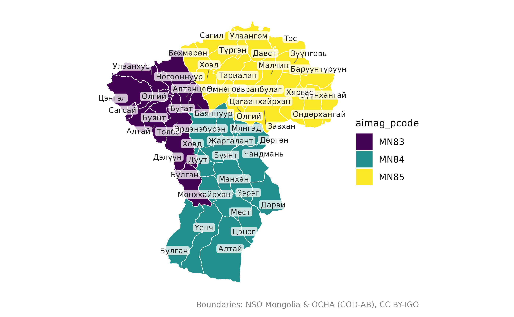
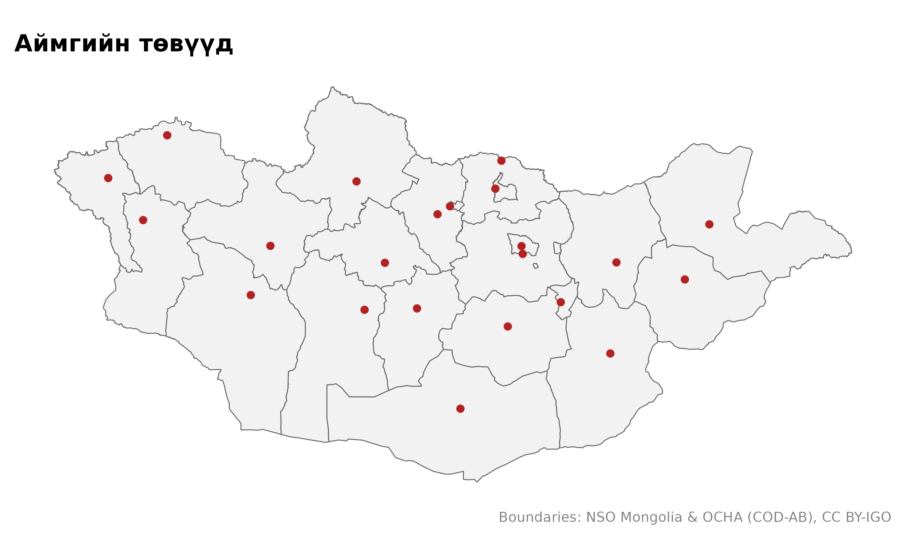
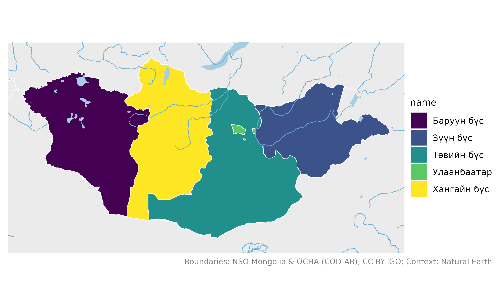
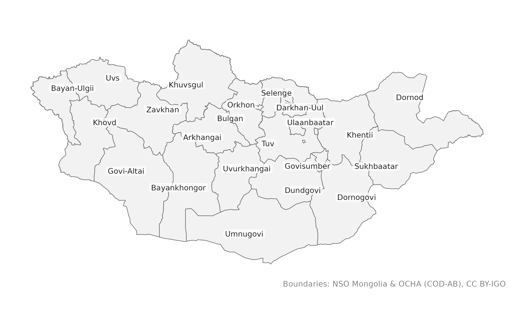

# mongolmaps багцтай танилцах

mongolmaps нь Монгол Улсын бэлэн газрын зургийг R програмд өгдөг. Энэ
нийтлэлийн бүх жишээ интернетгүй ажиллана: хялбаршуулсан хил хязгаар
багц дотроо байдаг.

``` r

library(mongolmaps)
options(mongolmaps.lang = "mn")  # нэрийг монголоор
```

## Засаг захиргааны түвшин

Монгол Улс 21 аймаг, нийслэл Улаанбаатартай. Аймаг сумдад, сум багт
хуваагдана. Улаанбаатар 9 дүүрэгт, дүүрэг хороонд хуваагдана.

| mongolmaps дахь түвшин | Орон нутаг          | Улаанбаатар            |
|------------------------|---------------------|------------------------|
| `"country"`            | Монгол Улс          |                        |
| `"region"`             | эдийн засгийн 4 бүс | Улаанбаатар 5 дахь бүс |
| `"aimag"`              | 21 аймаг            | Улаанбаатар            |
| `"soum"`               | 330 сум             | 9 дүүрэг               |
| `"bag"`                | ~1,650 баг          | 204 хороо              |

Түвшин бүр өөрийн функцтэй:

``` r

mn_aimags()
#> Simple feature collection with 22 features and 15 fields
#> Geometry type: MULTIPOLYGON
#> Dimension:     XY
#> Bounding box:  xmin: 87.7345 ymin: 41.58183 xmax: 119.9315 ymax: 52.14835
#> Geodetic CRS:  WGS 84
#> # A tibble: 22 × 16
#>    pcode name      name_en name_mn name_mns level type  number iso_code nso_code
#>    <chr> <chr>     <chr>   <chr>   <chr>    <chr> <chr>  <int> <chr>    <chr>   
#>  1 MN11  Улаанбаа… Ulaanb… Улаанб… Ulaanba… aimag capi…     NA MN-1     511     
#>  2 MN21  Дорнод    Dornod  Дорнод  Dornod   aimag aimag     NA MN-061   421     
#>  3 MN22  Сүхбаатар Sukhba… Сүхбаа… Sükhbaa… aimag aimag     NA MN-051   422     
#>  4 MN23  Хэнтий    Khentii Хэнтий  Khentii  aimag aimag     NA MN-039   423     
#>  5 MN41  Төв       Tuv     Төв     Töv      aimag aimag     NA MN-047   341     
#>  6 MN42  Говьсүмб… Govisu… Говьсү… Govisüm… aimag aimag     NA MN-064   342     
#>  7 MN43  Сэлэнгэ   Selenge Сэлэнгэ Selenge  aimag aimag     NA MN-049   343     
#>  8 MN44  Дорноговь Dornog… Дорног… Dornogo… aimag aimag     NA MN-063   344     
#>  9 MN45  Дархан-У… Darkha… Дархан… Darkhan… aimag aimag     NA MN-037   345     
#> 10 MN46  Өмнөговь  Umnugo… Өмнөго… Ömnögovi aimag aimag     NA MN-053   346     
#> # ℹ 12 more rows
#> # ℹ 6 more variables: parent_pcode <chr>, region_pcode <chr>,
#> #   aimag_pcode <chr>, soum_pcode <chr>, area_km2 <dbl>,
#> #   geometry <MULTIPOLYGON [°]>
```

Бүгд ижил баганатай:

- `pcode`: аль ч түвшинд нэгжийг ялгах код;
- `name`, `name_en`, `name_mn`, `name_mns`: сонгосон хэл дээрх нэр,
  англи нэр (ҮСХ-ны бичлэгээр), кирил нэр, латин үсгээр (MNS 5217);
- `level`, `type`, `number`: нэгжийн төрөл;
- `iso_code`, `nso_code`: ISO 3166-2 болон ҮСХ-ны код;
- `parent_pcode`, `region_pcode`, `aimag_pcode`, `soum_pcode`: харьяалах
  нэгжүүд;
- `area_km2` талбай, `geometry` хил.

## Шүүх

Хэрэгтэй газраа нэрээр нь өгнө. Нэрийг ямар ч түгээмэл бичлэгээр бичиж
болно.

``` r

mn_soums(aimag = "Ховд")
#> Simple feature collection with 17 features and 15 fields
#> Geometry type: MULTIPOLYGON
#> Dimension:     XY
#> Bounding box:  xmin: 90.65037 ymin: 44.99983 xmax: 94.30692 ymax: 48.96636
#> Geodetic CRS:  WGS 84
#> # A tibble: 17 × 16
#>    pcode  name     name_en name_mn name_mns level type  number iso_code nso_code
#>    <chr>  <chr>    <chr>   <chr>   <chr>    <chr> <chr>  <int> <chr>    <chr>   
#>  1 MN8401 Жаргала… Jargal… Жаргал… Jargala… soum  soum      NA NA       18401   
#>  2 MN8404 Алтай    Altai   Алтай   Altai    soum  soum      NA NA       18404   
#>  3 MN8407 Булган   Bulgan  Булган  Bulgan   soum  soum      NA NA       18407   
#>  4 MN8410 Буянт    Buyant  Буянт   Buyant   soum  soum      NA NA       18410   
#>  5 MN8413 Дарви    Darvi   Дарви   Darvi    soum  soum      NA NA       18413   
#>  6 MN8416 Дөргөн   Durgun  Дөргөн  Dörgön   soum  soum      NA NA       18416   
#>  7 MN8419 Дуут     Duut    Дуут    Duut     soum  soum      NA NA       18419   
#>  8 MN8422 Зэрэг    Zereg   Зэрэг   Zereg    soum  soum      NA NA       18422   
#>  9 MN8425 Манхан   Mankhan Манхан  Mankhan  soum  soum      NA NA       18425   
#> 10 MN8428 Мөнххай… Munkhk… Мөнхха… Mönkhkh… soum  soum      NA NA       18428   
#> 11 MN8431 Мөст     Must    Мөст    Möst     soum  soum      NA NA       18431   
#> 12 MN8434 Мянгад   Myangad Мянгад  Myangad  soum  soum      NA NA       18434   
#> 13 MN8437 Үенч     Uyench  Үенч    Üyench   soum  soum      NA NA       18437   
#> 14 MN8440 Ховд     Khovd   Ховд    Khovd    soum  soum      NA NA       18440   
#> 15 MN8443 Цэцэг    Tsetseg Цэцэг   Tsetseg  soum  soum      NA NA       18443   
#> 16 MN8446 Чандмань Chandm… Чандма… Chandma… soum  soum      NA NA       18446   
#> 17 MN8449 Эрдэнэб… Erdene… Эрдэнэ… Erdeneb… soum  soum      NA NA       18449   
#> # ℹ 6 more variables: parent_pcode <chr>, region_pcode <chr>,
#> #   aimag_pcode <chr>, soum_pcode <chr>, area_km2 <dbl>,
#> #   geometry <MULTIPOLYGON [°]>
mn_aimags(region = "Баруун бүс")
#> Simple feature collection with 5 features and 15 fields
#> Geometry type: MULTIPOLYGON
#> Dimension:     XY
#> Bounding box:  xmin: 87.7345 ymin: 42.69975 xmax: 99.20735 ymax: 50.88443
#> Geodetic CRS:  WGS 84
#> # A tibble: 5 × 16
#>   pcode name       name_en name_mn name_mns level type  number iso_code nso_code
#>   <chr> <chr>      <chr>   <chr>   <chr>    <chr> <chr>  <int> <chr>    <chr>   
#> 1 MN81  Завхан     Zavkhan Завхан  Zavkhan  aimag aimag     NA MN-057   181     
#> 2 MN82  Говь-Алтай Govi-A… Говь-А… Govi-Al… aimag aimag     NA MN-065   182     
#> 3 MN83  Баян-Өлгий Bayan-… Баян-Ө… Bayan-Ö… aimag aimag     NA MN-071   183     
#> 4 MN84  Ховд       Khovd   Ховд    Khovd    aimag aimag     NA MN-043   184     
#> 5 MN85  Увс        Uvs     Увс     Uvs      aimag aimag     NA MN-046   185     
#> # ℹ 6 more variables: parent_pcode <chr>, region_pcode <chr>,
#> #   aimag_pcode <chr>, soum_pcode <chr>, area_km2 <dbl>,
#> #   geometry <MULTIPOLYGON [°]>
```

## Газрын зураг зурах

[`mn_map()`](https://temuulene.github.io/mongolmaps/mn/reference/mn_map.md)
эдгээрийг ggplot2-оор зурна.

``` r

mn_map(mn_soums(aimag = c("Ховд", "Увс", "Баян-Өлгий")), fill = aimag_pcode, label = TRUE)
```



Энгийн ggplot буцаадаг тул дээр нь давхарга нэмж болно:

``` r

library(ggplot2)
mn_map(mn_aimags()) +
  geom_sf(data = mn_settlements(type = c("capital", "aimag_centre")), colour = "firebrick") +
  labs(title = "Аймгийн төвүүд")
```



`context = TRUE` бол хөрш орнууд, гол мөрөн, нуурыг нэмж зурна:

``` r

mn_map(mn_regions(), fill = name, context = TRUE)
```



## Проекц

Хил хязгаар уртраг, өргөрөгөөр (EPSG:4326) ирдэг.
[`mn_map()`](https://temuulene.github.io/mongolmaps/mn/reference/mn_map.md)
өөрөө проекцлоно; өөрөө проекцлох бол `crs`-ийг ашиглана:

``` r

mn_aimags(crs = "albers")
#> Simple feature collection with 22 features and 15 fields
#> Geometry type: MULTIPOLYGON
#> Dimension:     XY
#> Bounding box:  xmin: -1182877 ymin: -601751.4 xmax: 1207275 ymax: 584211.5
#> Projected CRS: +proj=aea +lat_0=47 +lon_0=104 +lat_1=43.5 +lat_2=50.5 +x_0=0 +y_0=0 +datum=WGS84 +units=m +no_defs
#> # A tibble: 22 × 16
#>    pcode name      name_en name_mn name_mns level type  number iso_code nso_code
#>  * <chr> <chr>     <chr>   <chr>   <chr>    <chr> <chr>  <int> <chr>    <chr>   
#>  1 MN11  Улаанбаа… Ulaanb… Улаанб… Ulaanba… aimag capi…     NA MN-1     511     
#>  2 MN21  Дорнод    Dornod  Дорнод  Dornod   aimag aimag     NA MN-061   421     
#>  3 MN22  Сүхбаатар Sukhba… Сүхбаа… Sükhbaa… aimag aimag     NA MN-051   422     
#>  4 MN23  Хэнтий    Khentii Хэнтий  Khentii  aimag aimag     NA MN-039   423     
#>  5 MN41  Төв       Tuv     Төв     Töv      aimag aimag     NA MN-047   341     
#>  6 MN42  Говьсүмб… Govisu… Говьсү… Govisüm… aimag aimag     NA MN-064   342     
#>  7 MN43  Сэлэнгэ   Selenge Сэлэнгэ Selenge  aimag aimag     NA MN-049   343     
#>  8 MN44  Дорноговь Dornog… Дорног… Dornogo… aimag aimag     NA MN-063   344     
#>  9 MN45  Дархан-У… Darkha… Дархан… Darkhan… aimag aimag     NA MN-037   345     
#> 10 MN46  Өмнөговь  Umnugo… Өмнөго… Ömnögovi aimag aimag     NA MN-053   346     
#> # ℹ 12 more rows
#> # ℹ 6 more variables: parent_pcode <chr>, region_pcode <chr>,
#> #   aimag_pcode <chr>, soum_pcode <chr>, area_km2 <dbl>,
#> #   geometry <MULTIPOLYGON [m]>
```

[`mn_crs()`](https://temuulene.github.io/mongolmaps/mn/reference/mn_crs.md)
проекцуудыг буцаана: улсын хэмжээний зурагт Альберсийн тэнцүү талбайт
проекц, Улаанбаатарт UTM-ийн 48N бүс.

## Хэл

Нэрийг англиар харуулах бол `lang = "en"`:

``` r

mn_map(mn_aimags(), label = TRUE, lang = "en")
```



Бүх функцэд нэг дор тохируулах бол `options(mongolmaps.lang = "en")`
эсвэл `"mn"`.

## Илүү нарийвчлал

Багцтай ирдэг хил хялбаршуулсан. Нарийн ажилд `resolution = "high"`
ашиглана: бүрэн нарийвчлалтай хилийг (ойролцоогоор 10 МБ) нэг удаа
татаж, хадгална.

``` r

mn_soums(aimag = "Ховд", resolution = "high")
```

## Өгөгдлийн эх сурвалж

``` r

mn_sources()[c("id", "provider", "license")]
#> # A tibble: 16 × 3
#>    id             provider                                               license
#>    <chr>          <chr>                                                  <chr>  
#>  1 admin          National Statistics Office of Mongolia; OCHA           CC BY-…
#>  2 khoroos        khoroo-map (GitHub Tuvshin-Level/khoroo-map)           0BSD   
#>  3 codes          National Statistics Office of Mongolia                 Open d…
#>  4 settlements    Wikidata                                               CC0 1.0
#>  5 naturalearth   Natural Earth                                          Public…
#>  6 admin_high     National Statistics Office of Mongolia; OCHA; khoroo-… CC BY-…
#>  7 osm_roads      OpenStreetMap contributors (via HOT export)            ODbL 1…
#>  8 osm_transport  OpenStreetMap contributors (via HOT export)            ODbL 1…
#>  9 osm_water      OpenStreetMap contributors (via HOT export)            ODbL 1…
#> 10 osm_places     OpenStreetMap contributors (via HOT export)            ODbL 1…
#> 11 elevation_1km  Copernicus DEM GLO-90 (DLR; Airbus; ESA; European Uni… Copern…
#> 12 landcover_1km  ESA WorldCover project                                 CC BY …
#> 13 copernicus_dem Copernicus DEM GLO-90 (DLR; Airbus; ESA; European Uni… Copern…
#> 14 worldcover     ESA WorldCover project                                 CC BY …
#> 15 worldpop       WorldPop (University of Southampton)                   CC BY …
#> 16 wdpa           UNEP-WCMC and IUCN (Protected Planet)                  WDPA t…
```

Эх сурвалжийг дурдана уу;
[`mn_citation()`](https://temuulene.github.io/mongolmaps/mn/reference/mn_sources.md)
бичвэрийг нь өгнө.
