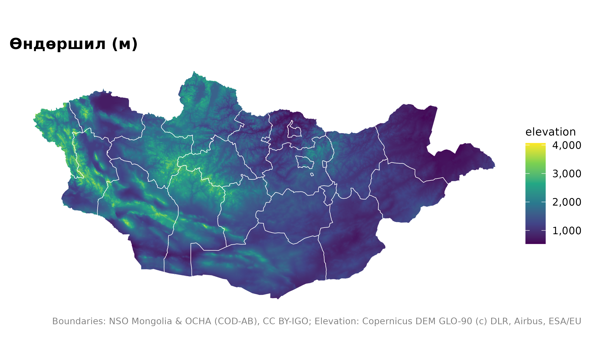
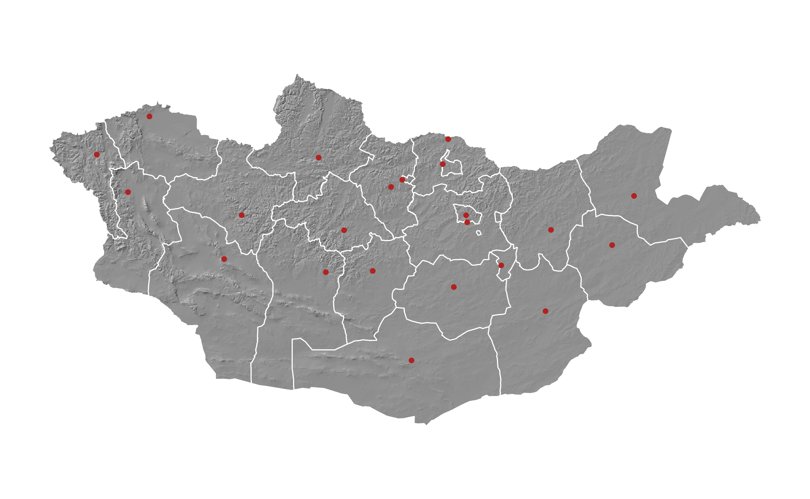
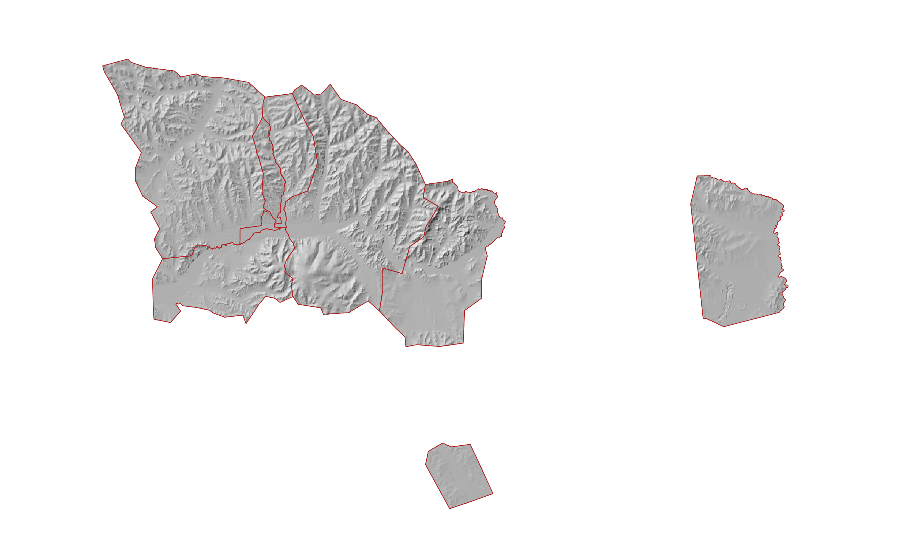
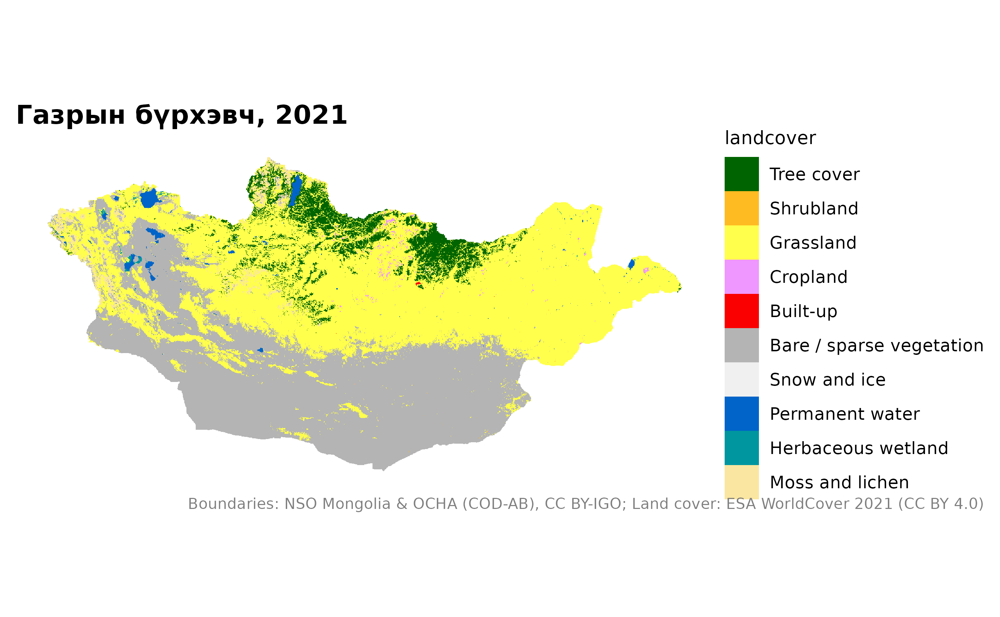
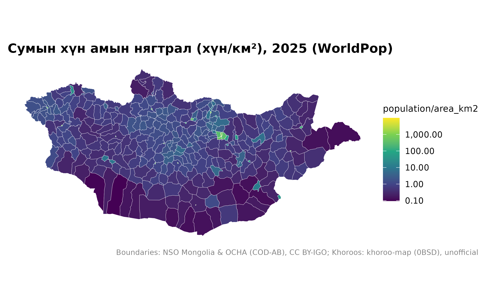

# Гадаргуу, газрын бүрхэвч, хүн ам, тусгай хамгаалалттай газар

``` r

library(mongolmaps)
library(ggplot2)
options(mongolmaps.lang = "mn")
```

Эдгээр давхарга нь растер (нүдэн тор) бөгөөд `terra` багцын SpatRaster
хэлбэрээр ирнэ. Улсын 1 км-ийн торыг нэг удаа татаж хадгална; илүү
нарийн торыг нэг газраар нь үүлнээс шууд уншина.

| Функц | Нарийвчлал | Эх сурвалж |
|----|----|----|
| [`mn_elevation()`](https://temuulene.github.io/mongolmaps/mn/reference/mn_elevation.md), [`mn_hillshade()`](https://temuulene.github.io/mongolmaps/mn/reference/mn_elevation.md) | 1 км (улсаар), 90 м (газраар) | Copernicus DEM GLO-90 |
| [`mn_landcover()`](https://temuulene.github.io/mongolmaps/mn/reference/mn_landcover.md) | 1 км (улсаар), 10 м (газраар) | ESA WorldCover 2021 |
| [`mn_population()`](https://temuulene.github.io/mongolmaps/mn/reference/mn_population.md) | 1 км, 100 м; 2015-2030 он | WorldPop |

[`mn_map()`](https://temuulene.github.io/mongolmaps/mn/reference/mn_map.md)
растерийг ч зохих өнгө, эх сурвалжийн тэмдэглэлтэй зурна.

## Гадаргуу

``` r

mn_map(mn_elevation(), title = "Өндөршил (м)") +
  geom_sf(data = mn_aimags(), fill = NA, colour = "white", linewidth = 0.2)
```



Рельефийн сүүдэр бусад давхаргын дэвсгэрт тохиромжтой:

``` r

mn_map(mn_hillshade(), caption = FALSE) +
  geom_sf(data = mn_aimags(), fill = NA, colour = "white", linewidth = 0.3) +
  geom_sf(data = mn_settlements(type = c("capital", "aimag_centre")), colour = "firebrick", size = 1)
```



Нэг газарт 90 м-ийн нарийвчлалаар:

``` r

mn_map(mn_hillshade("90m", within = "Улаанбаатар"), caption = FALSE) +
  geom_sf(data = mn_ub_districts(), fill = NA, colour = "firebrick")
#> Warning: Raster pixels are placed at uneven horizontal intervals and will be shifted
#> ℹ Consider using `geom_tile()` instead.
#> Raster pixels are placed at uneven horizontal intervals and will be shifted
#> ℹ Consider using `geom_tile()` instead.
```



## Газрын бүрхэвч

``` r

mn_map(mn_landcover(), title = "Газрын бүрхэвч, 2021")
```



## Хүн ам

[`mn_zonal()`](https://temuulene.github.io/mongolmaps/mn/reference/mn_zonal.md)
торыг дурын олигоноор, жишээ нь сумаар нэгтгэнэ:

``` r

pop <- mn_population(2025)
soums <- mn_zonal(pop, mn_soums(), name = "population")
mn_map(soums, fill = population / area_km2, trans = "log10",
       title = "Сумын хүн амын нягтрал (хүн/км²), 2025 (WorldPop)")
```



## Тусгай хамгаалалттай газар

Дэлхийн тусгай хамгаалалттай газрын мэдээллийн сан (WDPA)-г дахин тараах
эрхгүй тул анх ашиглахад UNEP-WCMC-ээс татна:

``` r

pa <- mn_protected_areas()
mn_map(mn_aimags(), caption = FALSE) +
  geom_sf(data = pa, aes(fill = desig_eng), alpha = 0.6, colour = NA) +
  labs(fill = NULL, caption = mn_citation(c("admin", "wdpa")))
```


