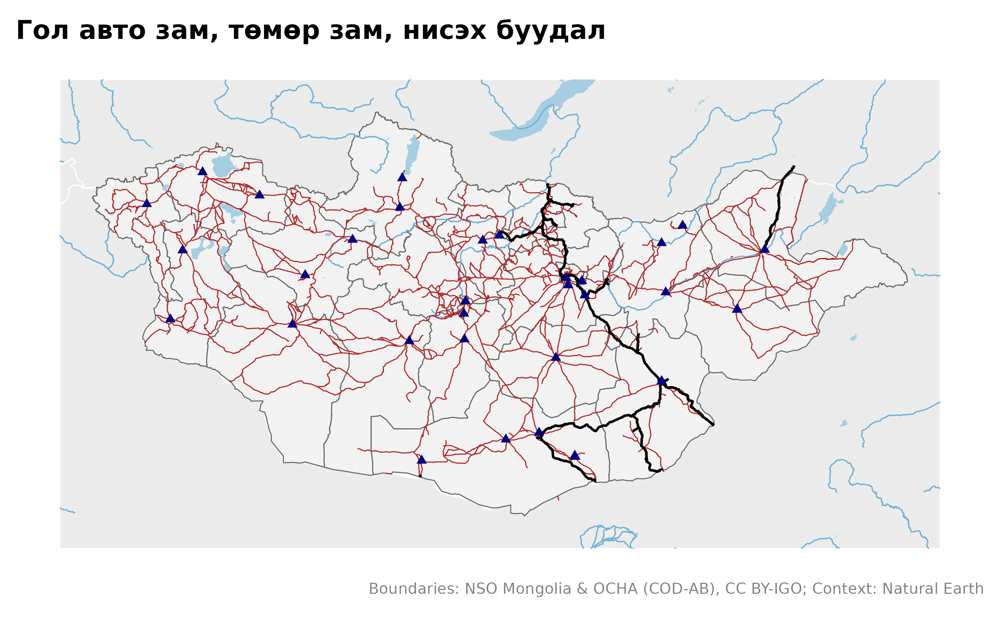
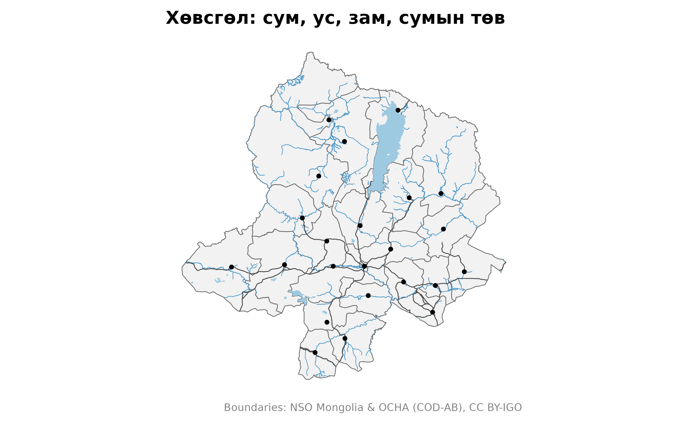
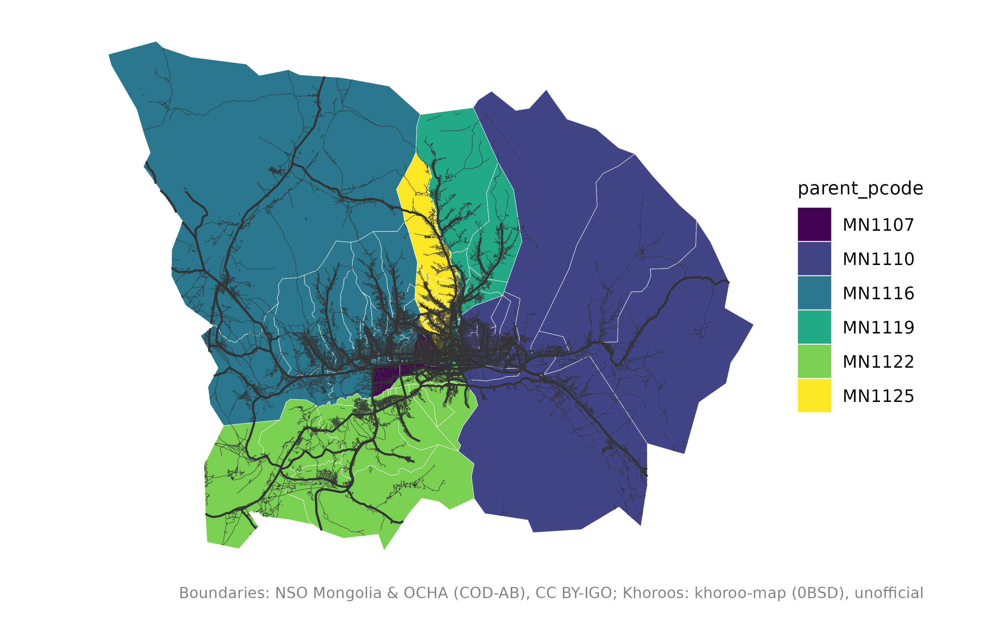

# Сэдэвчилсэн давхарга: зам, ус, суурин

``` r

library(mongolmaps)
library(ggplot2)
options(mongolmaps.lang = "mn")
```

Хил хязгаараас гадна mongolmaps газрын зургийг уншигдахуйц болгох
давхаргуудыг өгнө. Жижиг давхарга багцтай ирдэг; томыг нь нэг удаа
татаж, хадгална
([`mn_cache_dir()`](https://temuulene.github.io/mongolmaps/mn/reference/mn_cache_dir.md)).

| Функц | Агуулга | Эх сурвалж | Хэрхэн авах |
|----|----|----|----|
| [`mn_settlements()`](https://temuulene.github.io/mongolmaps/mn/reference/mn_settlements.md) | нийслэл, аймаг, сумын төв | Wikidata | багцад |
| [`mn_neighbours()`](https://temuulene.github.io/mongolmaps/mn/reference/mn_neighbours.md) | Монголын эргэн тойрон дахь Орос, Хятад, Казахстан | Natural Earth | багцад |
| [`mn_rivers()`](https://temuulene.github.io/mongolmaps/mn/reference/mn_neighbours.md), [`mn_lakes()`](https://temuulene.github.io/mongolmaps/mn/reference/mn_neighbours.md) | томоохон гол, нуур | Natural Earth | багцад |
| `mn_rivers("all")`, `mn_lakes("all")` | бүх гол, горхи, усан сан | OpenStreetMap | татна, ~20 МБ |
| [`mn_roads()`](https://temuulene.github.io/mongolmaps/mn/reference/mn_roads.md) | авто зам, гудамж | OpenStreetMap | татна, ~30 МБ |
| [`mn_railways()`](https://temuulene.github.io/mongolmaps/mn/reference/mn_roads.md), [`mn_airports()`](https://temuulene.github.io/mongolmaps/mn/reference/mn_roads.md) | төмөр зам, өртөө, нисэх буудал | OpenStreetMap | татна, \<1 МБ |
| [`mn_places()`](https://temuulene.github.io/mongolmaps/mn/reference/mn_roads.md) | хот, тосгон, суурин | OpenStreetMap | татна, \<1 МБ |

## Улсын хэмжээнд

``` r

mn_map(mn_aimags(), context = TRUE) +
  geom_sf(data = mn_roads(), colour = "firebrick", linewidth = 0.25) +
  geom_sf(data = mn_railways(), colour = "black", linewidth = 0.6) +
  geom_sf(data = mn_airports(), shape = 17, colour = "navy") +
  labs(title = "Гол авто зам, төмөр зам, нисэх буудал")
```



## Нэг аймаг

`within` тухайн газар доторх объектуудыг үлдээж, шугамыг хил дээр нь
тасална:

``` r

aimag <- "Хөвсгөл"
mn_map(mn_soums(aimag = aimag)) +
  geom_sf(data = mn_lakes("all", within = aimag), fill = "#9ecae1", colour = NA) +
  geom_sf(data = mn_rivers("all", within = aimag), colour = "#4292c6", linewidth = 0.2) +
  geom_sf(data = mn_roads(within = aimag), colour = "grey30", linewidth = 0.3) +
  geom_sf(data = mn_settlements(within = aimag), size = 1) +
  labs(title = "Хөвсгөл: сум, ус, зам, сумын төв")
```



## Улаанбаатарын гудамж

``` r

central <- c("БГД", "БЗД", "ЧД", "ХУД", "СХД", "СБД")
streets <- mn_roads(class = c("main", "minor"), within = central)
#> Re-reading with feature count reset from 34522 to 34521
mn_map(mn_khoroos(district = central), fill = parent_pcode) +
  geom_sf(data = streets, aes(linewidth = class), colour = "grey20") +
  scale_linewidth_manual(values = c(main = 0.5, minor = 0.1), guide = "none")
```



## Эх сурвалжийг дурдах

OpenStreetMap-ийн давхарга Open Database License (ODbL) лицензтэй.
Нийтлэхдээ дурдана уу:

``` r

mn_citation(c("admin", "osm_roads", "osm_water"))
#> [1] "Boundaries: NSO Mongolia & OCHA (COD-AB), CC BY-IGO; Roads: (c) OpenStreetMap contributors, ODbL; Water: (c) OpenStreetMap contributors, ODbL"
```
