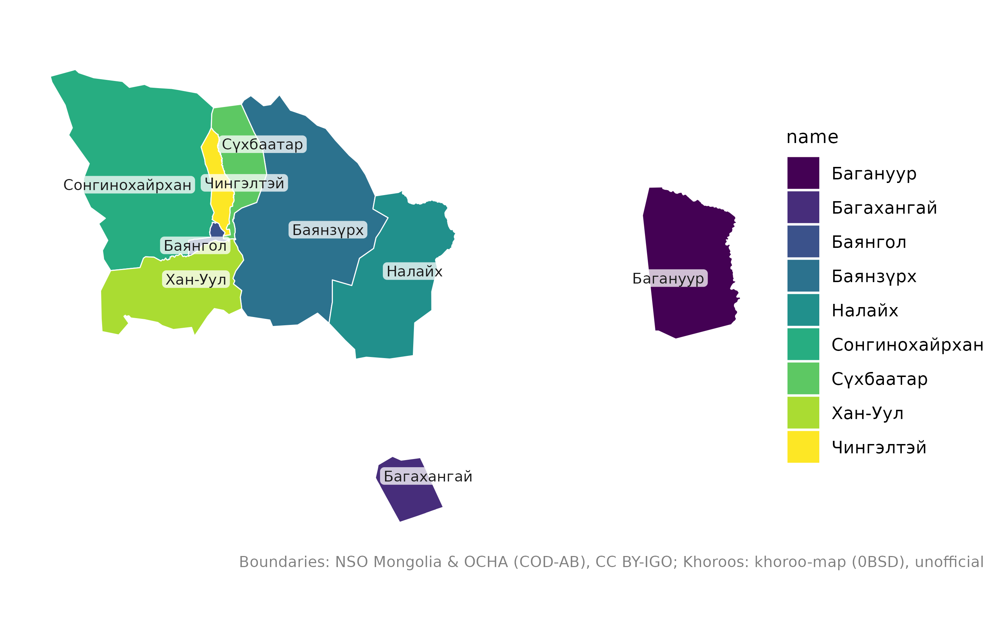
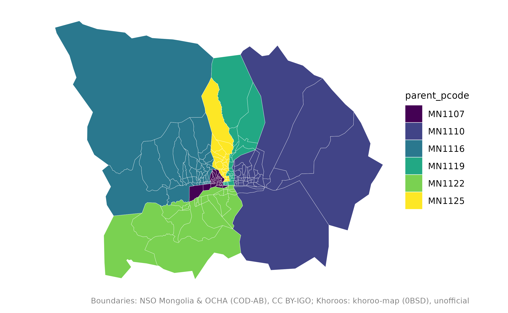
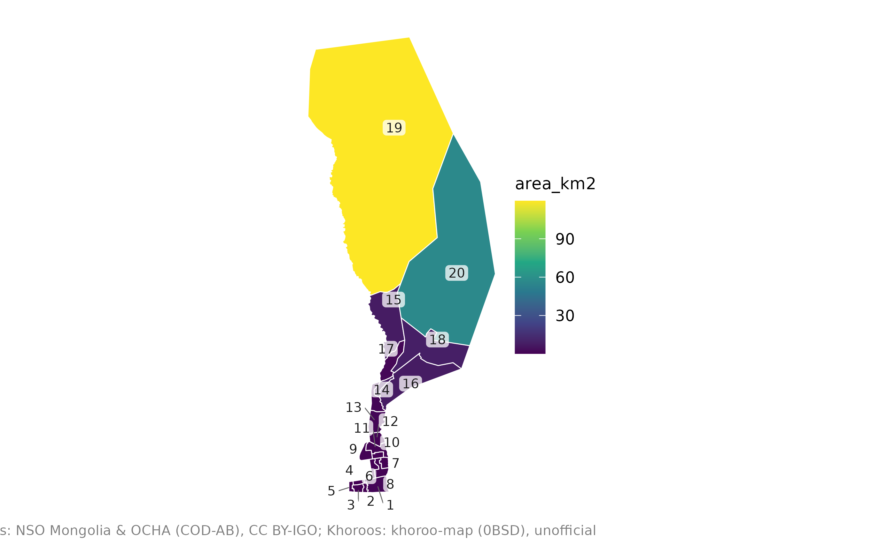
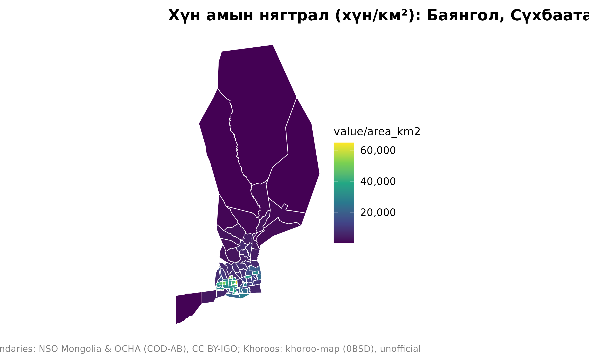

# Улаанбаатарын газрын зураг

``` r

library(mongolmaps)
options(mongolmaps.lang = "mn")
```

Улаанбаатар гурван түвшний газрын зурагтай: хот, 9 дүүрэг, 204 хороо.
Давхаргууд хоорондоо яг таарна.

``` r

mn_ub()
#> Simple feature collection with 1 feature and 15 fields
#> Geometry type: MULTIPOLYGON
#> Dimension:     XY
#> Bounding box:  xmin: 106.3626 ymin: 47.30196 xmax: 108.5008 ymax: 48.27193
#> Geodetic CRS:  WGS 84
#> # A tibble: 1 × 16
#>   pcode name       name_en name_mn name_mns level type  number iso_code nso_code
#>   <chr> <chr>      <chr>   <chr>   <chr>    <chr> <chr>  <int> <chr>    <chr>   
#> 1 MN11  Улаанбаат… Ulaanb… Улаанб… Ulaanba… aimag capi…     NA MN-1     511     
#> # ℹ 6 more variables: parent_pcode <chr>, region_pcode <chr>,
#> #   aimag_pcode <chr>, soum_pcode <chr>, area_km2 <dbl>,
#> #   geometry <MULTIPOLYGON [°]>
mn_ub_districts()
#> Simple feature collection with 9 features and 15 fields
#> Geometry type: MULTIPOLYGON
#> Dimension:     XY
#> Bounding box:  xmin: 106.3626 ymin: 47.30196 xmax: 108.5008 ymax: 48.27193
#> Geodetic CRS:  WGS 84
#> # A tibble: 9 × 16
#>   pcode  name      name_en name_mn name_mns level type  number iso_code nso_code
#>   <chr>  <chr>     <chr>   <chr>   <chr>    <chr> <chr>  <int> <chr>    <chr>   
#> 1 MN1101 Багануур  Baganu… Багану… Baganuur soum  dist…     NA NA       51101   
#> 2 MN1104 Багаханг… Bagakh… Багаха… Bagakha… soum  dist…     NA NA       51104   
#> 3 MN1107 Баянгол   Bayang… Баянгол Bayangol soum  dist…     NA NA       51107   
#> 4 MN1110 Баянзүрх  Bayanz… Баянзү… Bayanzü… soum  dist…     NA NA       51110   
#> 5 MN1113 Налайх    Nalaikh Налайх  Nalaikh  soum  dist…     NA NA       51113   
#> 6 MN1116 Сонгинох… Songin… Сонгин… Songino… soum  dist…     NA NA       51116   
#> 7 MN1119 Сүхбаатар Sukhba… Сүхбаа… Sükhbaa… soum  dist…     NA NA       51119   
#> 8 MN1122 Хан-Уул   Khan-U… Хан-Уул Khan-Uul soum  dist…     NA NA       51122   
#> 9 MN1125 Чингэлтэй Chinge… Чингэл… Chingel… soum  dist…     NA NA       51125   
#> # ℹ 6 more variables: parent_pcode <chr>, region_pcode <chr>,
#> #   aimag_pcode <chr>, soum_pcode <chr>, area_km2 <dbl>,
#> #   geometry <MULTIPOLYGON [°]>
mn_khoroos()
#> Simple feature collection with 204 features and 15 fields
#> Geometry type: MULTIPOLYGON
#> Dimension:     XY
#> Bounding box:  xmin: 106.3626 ymin: 47.30196 xmax: 108.5008 ymax: 48.27193
#> Geodetic CRS:  WGS 84
#> # A tibble: 204 × 16
#>    pcode    name   name_en name_mn name_mns level type  number iso_code nso_code
#>    <chr>    <chr>  <chr>   <chr>   <chr>    <chr> <chr>  <int> <chr>    <chr>   
#>  1 MN110151 1-р х… 1-r kh… 1-р хо… 1-r kho… bag   khor…      1 NA       5110151 
#>  2 MN110153 2-р х… 2-r kh… 2-р хо… 2-r kho… bag   khor…      2 NA       5110153 
#>  3 MN110155 3-р х… 3-r kh… 3-р хо… 3-r kho… bag   khor…      3 NA       5110155 
#>  4 MN110157 4-р х… 4-r kh… 4-р хо… 4-r kho… bag   khor…      4 NA       5110157 
#>  5 MN110159 5-р х… 5-r kh… 5-р хо… 5-r kho… bag   khor…      5 NA       5110159 
#>  6 MN110451 1-р х… 1-r kh… 1-р хо… 1-r kho… bag   khor…      1 NA       5110451 
#>  7 MN110453 2-р х… 2-r kh… 2-р хо… 2-r kho… bag   khor…      2 NA       5110453 
#>  8 MN110751 1-р х… 1-r kh… 1-р хо… 1-r kho… bag   khor…      1 NA       5110751 
#>  9 MN110752 26-р … 26-r k… 26-р х… 26-r kh… bag   khor…     26 NA       5110752 
#> 10 MN110753 2-р х… 2-r kh… 2-р хо… 2-r kho… bag   khor…      2 NA       5110753 
#> # ℹ 194 more rows
#> # ℹ 6 more variables: parent_pcode <chr>, region_pcode <chr>,
#> #   aimag_pcode <chr>, soum_pcode <chr>, area_km2 <dbl>,
#> #   geometry <MULTIPOLYGON [°]>
```

## Дүүрэг

``` r

mn_map(mn_ub_districts(), fill = name, label = TRUE)
```



Багануур, Багахангай нь хотын төвөөс зүүн болон зүүн өмнө зүгт тусдаа
байрладаг. Хотын төвд анхаарах бол хэрэгтэй дүүргүүдээ сонгоно:

``` r

central <- c("Баянгол", "Баянзүрх", "Чингэлтэй", "Хан-Уул", "Сонгинохайрхан", "Сүхбаатар дүүрэг")
mn_map(mn_khoroos(district = central), fill = parent_pcode)
```



Дүүргийн нэрийг “БЗД”, “СБД”, “ХУД” гэх мэт товчлолоор, мөн латинаар
бичиж болно:

``` r

mn_khoroos(district = "БЗД")
#> Simple feature collection with 43 features and 15 fields
#> Geometry type: MULTIPOLYGON
#> Dimension:     XY
#> Bounding box:  xmin: 106.9215 ymin: 47.72161 xmax: 107.4114 ymax: 48.20897
#> Geodetic CRS:  WGS 84
#> # A tibble: 43 × 16
#>    pcode    name   name_en name_mn name_mns level type  number iso_code nso_code
#>    <chr>    <chr>  <chr>   <chr>   <chr>    <chr> <chr>  <int> <chr>    <chr>   
#>  1 MN111051 1-р х… 1-r kh… 1-р хо… 1-r kho… bag   khor…      1 NA       5111051 
#>  2 MN111052 26-р … 26-r k… 26-р х… 26-r kh… bag   khor…     26 NA       5111052 
#>  3 MN111053 2-р х… 2-r kh… 2-р хо… 2-r kho… bag   khor…      2 NA       5111053 
#>  4 MN111054 27-р … 27-r k… 27-р х… 27-r kh… bag   khor…     27 NA       5111054 
#>  5 MN111055 3-р х… 3-r kh… 3-р хо… 3-r kho… bag   khor…      3 NA       5111055 
#>  6 MN111056 28-р … 28-r k… 28-р х… 28-r kh… bag   khor…     28 NA       5111056 
#>  7 MN111057 4-р х… 4-r kh… 4-р хо… 4-r kho… bag   khor…      4 NA       5111057 
#>  8 MN111058 29-р … 29-r k… 29-р х… 29-r kh… bag   khor…     29 NA       5111058 
#>  9 MN111059 5-р х… 5-r kh… 5-р хо… 5-r kho… bag   khor…      5 NA       5111059 
#> 10 MN111060 30-р … 30-r k… 30-р х… 30-r kh… bag   khor…     30 NA       5111060 
#> # ℹ 33 more rows
#> # ℹ 6 more variables: parent_pcode <chr>, region_pcode <chr>,
#> #   aimag_pcode <chr>, soum_pcode <chr>, area_km2 <dbl>,
#> #   geometry <MULTIPOLYGON [°]>
```

## Хороо

Хороо дүүрэг дотроо дугаартай; дугаар нь `number` баганад байна, мөн
`mn_map(label = TRUE)` үүнийг харуулна.

``` r

mn_map(mn_khoroos(district = "Сүхбаатар дүүрэг"), fill = area_km2, label = TRUE)
```



Нэг хороог олох бол
[`mn_match()`](https://temuulene.github.io/mongolmaps/mn/reference/mn_match.md)-д
дүүргийг нь зааж өгнө:

``` r

mn_match("15-р хороо", level = "bag", within = "Баянгол дүүрэг")
#> [1] "MN110779"
mn_match("Баянгол 15")
#> [1] "MN110779"
```

## Статистик холбох

ҮСХ олон үзүүлэлтийг хороогоор нийтэлдэг. Жишээ өгөгдөлд жилийн дундаж
хүн ам байна:

``` r

pop <- mn_example_population[mn_example_population$Year == 2025, ]
khoroo_pop <- mn_join(pop, by = "Region", level = "bag", within = "Улаанбаатар")

mn_map(
  khoroo_pop[khoroo_pop$parent_pcode %in% c("MN1107", "MN1119", "MN1125"), ],
  fill = value / area_km2,
  title = "Хүн амын нягтрал (хүн/км²): Баянгол, Сүхбаатар, Чингэлтэй"
)
```



## Интерактив газрын зураг

``` r

mn_leaflet(khoroo_pop, fill = value)
```

## Хорооны хилийн тухай

Хорооны хилийг гарал үүслээ заагаагүй нээлттэй khoroo-map төслөөс авсан
тул **албан бус** гэж үзнэ үү. Хилийг Улаанбаатарын албан ёсны хилд
тааруулсан;
[`mn_ub_districts()`](https://temuulene.github.io/mongolmaps/mn/reference/mn_ub.md)
дахь дүүргийн хил нь хороодынх нь нийлбэр бөгөөд хотын одоогийн
хуваарийг дагана. Дэлгэрэнгүйг
[`?mn_khoroos`](https://temuulene.github.io/mongolmaps/mn/reference/mn_ub.md)-оос
харна уу.
